# Remote Command Service, ReCoS

Remote Command Service kurz ReCoS ist ein Programm, um Apps, Programme und Skripte aus der Ferne, von einem anderen Gerät aus, auszuführen zu können. Genau wie eine Makrotastatur, aber mit visuellem Feedback und mehr Interaktion. Du kannst mit deinem Handy oder Tablett auf deinem Rechner Programme starten, Tastatur Makros ausführen oder dir einfach nur die Uhrzeit anzeigen lassen. 
Das Programm besteht aus 3 verschiedenen Komponenten.
Zunächst ist da das Hauptprogramm, ein kleiner Golang-basierter Mikroservice, der alle Funktionen auf dem zu steuernden Rechner bereitstellt. Dieser Dienst läuft gewöhnlich im Hintergrund und sollte automatisch mit dem Rechner gestartet werden.
Auf der anderen Seite gibt es zwei Webanwendungen. 
Einmal der Client, der die Aktionen steuert, der auf dem steuernden Gerät gestartet werden kann, und ein Client der für die Konfiguration zuständig ist.

Folgende Funktionen können gesteuert werden: (Das ist natürlich nur ein Auszug aus den wichtigsten Funktionen)

- Lautstärke und Mikrofon Gain.
- OBS Studio integration: Steure Profile, Szenen und Stream und Aufnahme Funktionen 
- Starte einen Browser, den Explorer oder irgendein anderes Programm auf Tastendruck
- zeige dir ein Uhr in verschiedenen Designs an
- Zähle Ereignisse auf Knopfdruck
- zähle die Tage bis zu einem Ereigniss
- lass die Würfel rollen
- zeige dir Sensordaten deines PC an, CPU/GPU Auslastung oder Temperatur
- Kontrolliere deine Smarthome Produkte wie Homematic(C) oder Philips Hue(C)
- benutze die virtuelle Tastatur und sende belibige Tastenfolgen 
- steuere deinen Media Player
- zeig dir die Netzwerk Ping Zeit zu einem anderen Server an
- mach dein eigenes Soundboard: spiele belibige Mediadateien ab
- zufalls Wörter: lass dir aus einer Liste von Wörter zufällig eines auswählen
- mache einen Screenshot und speichere diesen automatisch in einen Ordner deiner Wahl
- zeige dir eine Stoppuhr an
- benutze einen Countdown-Timer
- Kontrolliere deinen Windows Desktop, aktiviere, verschiebe und minimiere Fenster 

# Installation

Die Installation ist einfach. Führ das Installationsprogramm aus. Nach der Installation startet der Dienst automatisch. Für den automatischen Start musst du nur im Kontextmenü Autostart wählen.

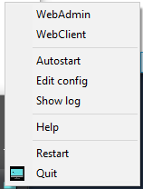

Jetzt kannst du einfach den Admin-Client mit WebAdmin aufrufen.

Für den Client wählst du WebClient. Wenn du den Client auf einem anderen Gerät ausführen möchtest, schau im nächsten Kapitel.

# ReCoS Client - Web Client Interface

## Verbinde ein Gerät

Einen Client zu verbinden ist einfach. Um den Client direkt auf derselben Maschine wie den ReCoS Service zu starten, klicke einfach auf das Task-Icon-Menü für den WebClient.


Wenn Du ein anderes Gerät, wie dein Smartphone oder Tablett, verbinden möchten, musst du dich zunächst mit dem Gerät verbinden, auf dem der ReCoS-Dienst ausgeführt wird, vorrausgesetzt beide Geräte sind im gleichen Netzwerk. Um diesen Vorgang zu vereinfachen, kann dir ReCoS fertige QR Codes für die Verbindung generieren. Dazu starte den Webadmin über das obige Menü. Klicke auf das Hilfemenü und dann auf das Menü Client QR Codes.

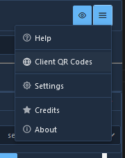

Wenn dieser Dialog sichtbar ist, kannst du eine Netzwerkschnittstellen auswählen und den QR-Code dafür scannen. (Falls du keine Möglichkeit hast, einen QR Code auf dem Gerät zu scannen, kannst du auch einfach den Interbrowser auf dem Gerät starten und die Adresse, die unter dem QR Code steht, verwenden.) Nachdem du diesen Code ausgeführt hast, wirst du zur richtigen Webseite weitergeleitet. Wenn es ein Problem gibt, verwende einfach einen anderen Eintrag. (Nicht jede Schnittstelle ist mit deinem Heimnetzwerk verbunden. Einige sind nur für den internen Gebrauch. Das Programm kann aber leider den Unterschied nicht erkennen.)

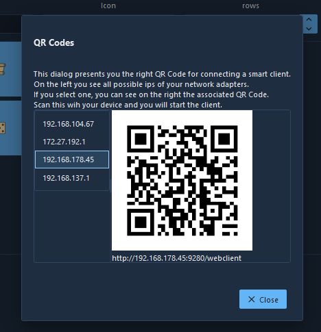

## Der WebClient

Dies ist der Haupt-ReCoS-Webclient zum Ausführen der konfigurierten Befehle. 


Der Client hat einen großen Schaltflächenbereich, der die verschiedenen Aktionen präsentiert. Aber fangen wir ganz am Anfang an. Zunächst ist alles in einem **Profil** organisiert. Du kannst unterschiedliche Profile für unterschiedliche Clients oder unterschiedliche Szenarien anlegen. Ein Client kann jeweils nur ein Profil präsentieren, aber du kannst verschiedene Profile gleichzeitig in verschiedenen Browsern geöffnet haben. Beispiel: Dukannst dir ein spezielles Profil für dein Telefon, ein Anderes für den Tablett und ein wirklich großes Profile für deinen PC anlegen. Und alle können gleichzeitig aktiv sein. Aber um es noch einmal zu betonen, Du kannst das gleiche Profil auch auf 2 verschiedenen Geräten gleichzeitig betreiben. Beim Starten des Clients wird immer das erste Profil ausgewählt. Du kannst das Profile mit der Profil-Combobox auf der Einstellungsseite auswählen. Zum Öffnen einfach den Button in der oberen rechten Ecke drücken.


Jedes Profil hat unterschiedliche **Seiten** zur weiteren Strukturierung. Beim Starten des Clients wird automatisch die erste Seite ausgewählt. Eine Seite besteht dann aus Zeilen und Spalten. Du kannst die Größe der Seite im Admin-Client einstellen. Je mehr Zeilen und Spalten du hast, desto kleiner werden die einzelnen Aktionen. Die Seite passt ihre Aktionen dem möglichen Raum an. Seiten können direkt über die Einstellungen (dargestellt als Schaltflächen, im Bild oben Default und Audio) oder über spezielle Aktionen geändert werden. Ob eine Seite im Einstellungsdialog erscheint, kann in der Seitenkonfiguration eingestellt werden. Wenn die Seite kein Symbol hat, wird nur der Name angezeigt.

Im Client-Bereich siehst du 2 Arten von Schaltflächen und möglicherweise etwas Leerraum. Zunächst sind da die grau hinterlegten Tasten, die Du drücken kannst. (**Single** Action) Dies ist das Standardverhalten. Beim Drücken wird die zugrunde liegenden Aktion auf dem Computer ausgeführt.

Die schwarz hinterlegten Schaltflächen dienen nur zur Anzeige. (**Display** Action) Dort werden Systemzustände oder andere Parameter angezeigt.

Die leeren Felder warten darauf, das Du dort eine Aktion zuordnest.

(Wenn Du ein Feld mit der roten Warnung „Action not defined“ siehst, liegt eine Fehlkonfiguration vor. Möglicherweise hast Du eine Aktion gelöscht und vergessen diese von der Schaltfläche zu entfernen.)

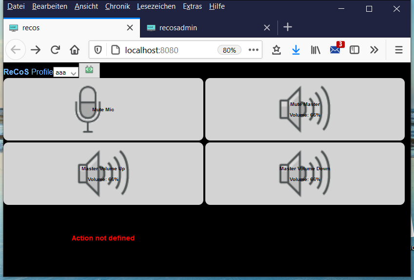

Schaltflächen oder Aktionen können mehrere Zustände haben. Je nach Situation werden dort dann unterschiedliche Icons angezeigt. Wenn ein Befehl aktuell ausgeführt wird, wird normalerweise die Sanduhr angezeigt. Bei mehreren Kommandos pro Aktion zeigt die Stellung der Sanduhr an, wie viele Befehle gerade ausgeführt worden sind. (Ja, Aktionen können eine Befehlsliste enthalten)

Besondere Aktionen: Bei sogenannten **Multi**-Aktionen durchläuft die Aktion eine Liste von anderen Aktionen. Die 1. Aktion wird beim 1. Drücken ausgeführt, die 2. beim 2. Drücken und so weiter. Der jeweilige Status wird durch das Symbol der entsprechenden Aktion dargestellt.

Wie bereits erwähnt, kann eine Aktion mehrere Befehle enthalten. (Die Aktion "Hello World" von der Demo enthält z.B. 3 Befehle: Notepad starten, einige Sekunden warten, "Hello ReCoS" schreiben)

# ReCoS Admin - Die Konfiguration

Der WebAdmin dient zur Konfiguration des ReCoS Systems. 

Alle modifizierenden Funktionen sind mit einem Passwort geschützt. Dieses Passwort kannst du im WebAdmin festlegen. Das Standardpasswort ist `recosadmin`. Zum Ändern gehst du auf das Icon rechts oben und wählst Settings


Im folgende Dialog findest du die Passworteinstellung ubter dem Reiter ReCoS Password


Wie üblich musst du hier sowohl dein altes Passwort wie auch 2x dein neues Passwort eingeben. Um die Passwortprüfung zu deaktivieren, benutze einfach ein leeres Passwort.

## Action Wizard

With the Action Wizard you can quickly and easily create new commands. You start the Action Wizard with this button.

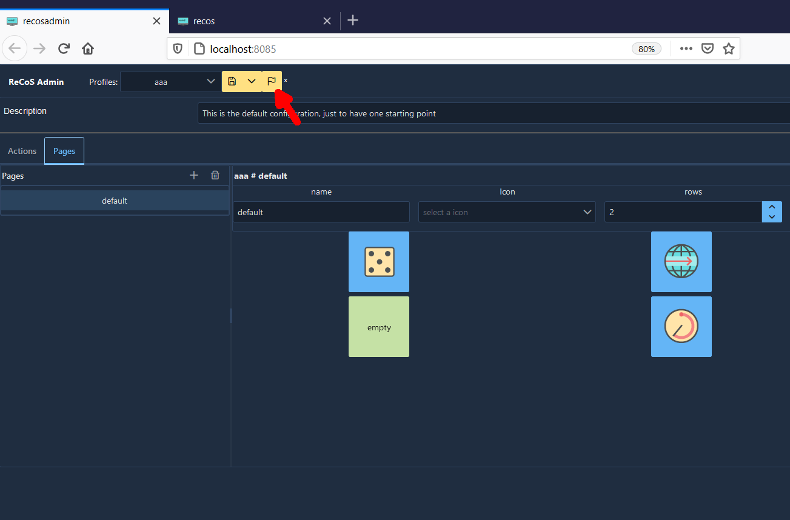

Or on the button assignments dialog:

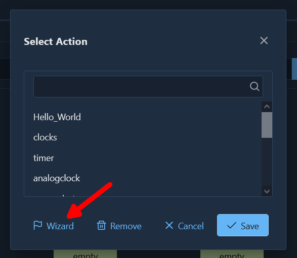

First you will see this preface page:


On the next page you can choose the command that should be generated. You can use the search field to search through the list of commands.

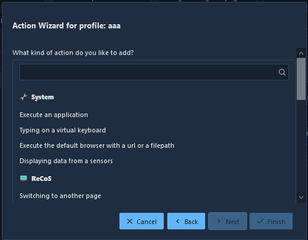

Go on with Next. 
In the next dialog you can provide some information about the command. You can assign a title for the button, assign an icon (a default is given directly by the command), and you can make various other settings depending on the command. Continue here with Next.


On this last page you can determine where the action should be displayed. You can select different pages here, or create a new page. Simply click on a free button where the action should be stored. To save the action and the profile, please select Finish.

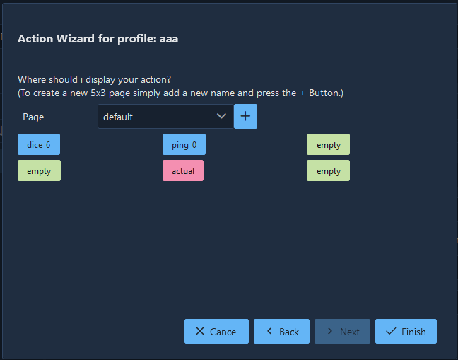

In the Admin Client you can then see what the wizard has generated for you.

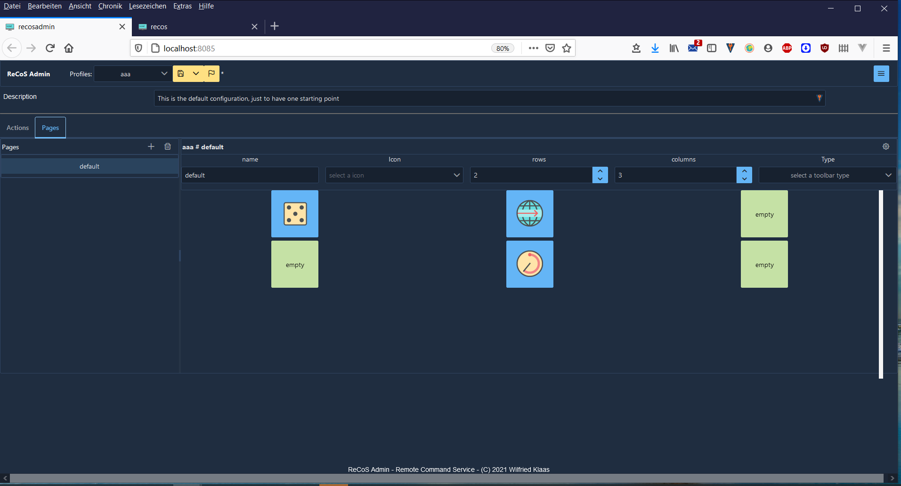

## Austauschen von Profilen, Aktionen und konfigurierten Seiten

Ihr könnt sowohl ganze Profile, Seiten wie auch einzelne Aktionen exportieren und auch wieder importieren. (z.B. um Sie mit Freunden zu teilen) Bei verschiedenen Aktionen müsst ihr euch aber versichern, dass die Aktionen nach einem Import noch funktionieren. Bei dem Kommando "Programm ausführen" steht üblicherweise der Pfad zu der ausführbaren Datei in der Konfiguration. Dieses kann natürlich auf deinem System ein anderer sein als der auf dem System deines Freundes. 

# ReCoS Service

The service is the main component of the ReCoS. This is the unit of work, doing all the nice things. But you will only see a little Icon in the taskbar. And there is a small context menu.


Here you can directly start the web interface or the admin client. And you can register the service to automatically start on windows start. Next option is to edit the service.yaml file, which contains all configuration for the service itself. Normally you don't need to do here anything, but just in case...
The last Menu entry is for shutting down the Service. 

## Profile configuration

Various profiles can be stored in the ReCoS. Each profile consists on the one hand of a list of actions and on the other hand of the pages that represent these actions. Each profile has a name and a list of actions and pages. You can also add a description after.

`name`: The name of the profile
`description`: a user readable description
`pages`: This are the different pages for showing up the actions
`actions`: a list of different actions. An action can appear on different pages. But as it's the same action, the status/result will be the same.

### Page

A page is a view component mainly showing with rows and columns. Each of this cells will than visualize an action. The cells list will link to an action by name in the action list. The index of an action of a cell is calculated as 

`index = (cell.row * page.rows) + cell.column`

parameters:

`name`: The name of the page
`description`: a user readable description
`icon`: the icon of this page
`columns`: Number of columns on the page
`rows`: Number of rows on the page
`toolbar`: `show`, this page will appear in the toolbar to directly switch to, `hide`, if this page should appear in the toolbar. With the page command you can switch to this page.
`cells`: List of names of the action per cell

### Action

An action is the part, which defines, what to do if a button is triggered. 

The following parameters are used:

`type`: **`SINGLE`** is a single shot action. The action is always starting the command list. 
**`DISPLAY`** is a display only cell. It will only show Text, Icons, or images, but you can't interact with it.
**`MULTI`** is the third option. Here you can define 3 or more stages, and on every stage you can define an action, which is fired on activating this stage. As you can see, a simple on/off switch is a Multi Action with 2 Stages.
`name`: s the name of the action
`title`: the title of the action used by the UI
`description`: user defined description of this action
`runone`: is true or false. On true, if the action is fired twice, all commands of the first execution must be finished before the second execution will take place. On false, the execution will start directly without checking the previous action execution state.
`icon`: the icon which will be displayed on the cell
`fontsize`: the size of the title and the text, defaults to 14
`fontcolor`: the color of the title and the text, defaults to black
`outlined`: true or false, sometime reading a black text on a black ground is a little bit difficult. lining out can help.
`commands`: list of commands for execution of this action
`actions`: only apply in a MULTI action. For every stage there should be the name of the action which will be called, when the stage is executed. If a stage is executed, the icon of the last executed action (stage) will be displayed as the icon of the multi action and the title will be displayed on the text line. 

### Commands

This is the unit of work, the part that is executed. This are the settings every command will use.

`type`: the type of the command
`name`: names the command
`description`: a user readable description
`icon`: an icon, that is displayed when running this command
`title`: a text that is displayed when running this command
The other parameters defers from command to command.

#### No Operation

Do nothing. (But you can change the text and the icon ;-) )

`Type`: `NOOP`

`Parameter`:  none

#### Audiocontrol

taking control over your audio devices.

With this command, you can take control different audio devices for setting volume and mute. 

`type`: `AUDIOVOLUME`

Parameter:
`device`: the device that you would like to control. There are different devices in your system. Which one you can select, can be seen in the admin interface or on startup in the console. There are 2 defaults: `master` for the master output. This is on widows the one that you can control directly with the taskbar icon. And `mic` which is for the default input device. 
`command`: this is the command you want to fire. `mute`, which toggles the mute state. `volume up` for increase and `volume down` for decreasing the volume of that device.

#### Clock


Just a clock in different designs.

`type`: `CLOCK`

`Parameter`: 

`format`: the format of the time in Golang format syntax, defaults: 15:04:05
`dateformat`: the format of the date in Golang format syntax, used by different designs, defaults: 02.01
`analog`: true or false, shows an analog clock
`timezone`: string with the name of the timezone of the IANA Timezone database (https://en.wikipedia.org/wiki/List_of_tz_database_time_zones)
`design`: the design of the clock. `analog` is for a analog clock, `digital` showing a nice digital clock, `berlin` is showing the berlin clock (https://en.wikipedia.org/wiki/Mengenlehreuhr).
There is another Berlin clock, called `berlin2`, which is created in svg format. It's usually better for smaller resolutions. 

`showseconds`: showing the seconds in the design. 
`showdate`: showing the date in the design formatted with dateformat. 
`color`: the color of the segments of the digital clock

Example 1: simple textual clock

Parameter:

```yaml
format: "15:04:05 02 Jan 06"
```

Example 2: showing a nice digital clock with red 7-segment digits 

```yaml
format: "02-01"
design: digital
showseconds: true
color: "#ff0000"
```

#### Counter


just a simple counter.

A simple counter, with persisting value.

`type`: `COUNTER`

`Parameter`: 
`persist`: true or false, if true, the counter will persist between service restarts
`oldschool`: rendering an old school counter with 7-segment digits
`color`: the color of the segments 

#### Days remain


show the days remains to a end date.

This will show the days remain until a end date.

`type`: `DAYSREMAIN`

`Parameter`: 

`date`: end date in format "yyyy-mm-dd"
`formatTitle`: the title message for the response, defaults %d
`formatText`: the text message for the response, defaults %d
`finished`: the message at the end of the days remain, defaults: finished

#### Delay

`type`: `DELAY`

`Parameter`: 

`time`: time to delay in Seconds

#### Dice


rolling the dice
A simple dice implementation with nice ui and different values.

`type`: `DICE`

`Parameter`: 
`sides`: the number of sides of the dice. For sides <= 9a nice UI is implemented.

#### Execute

`type`: `EXECUTE`

Parameter:

`command`: the executable or shell script to execute, with or without path
`args`: list of string arguments to this executable
`waitOnClose`: waits until the executable is closed or script is finnished.

#### Hardware monitor


This command connects to the openhardware monitor application on windows. With this you can get different sensors of your computer. For using the webserver of the openhardwaremonitor app, you have to activate the open hardware monitor integration in the settings. The url is the url to the app webserver added with data.json. the `updateperiod` is the update time in seconds. 

If you have configured this, the service will evaluate on startup the connection and all possible sensor names. This list of names you will see in the log and in the configuration there is a file sensorlist.txt with all sensors names. The sensor name starts with the category, like CPU, GPU or Memory, followed by the hardware component. After that there is the sensor type like Clocks, Temperatures or Load, followed by the sensor name. 

`type`: `HARDWAREMONITOR`

Parameter:
`sensor`: the sensor name.
`format`: the format string for the textual representation
`display`: text, graph,  text shows only the textual representation, graph shows both
`ymin`: the value for the floor of the graph
`ymax`: the value for the bottom of the graph
`color`: color of the graph

#### Homematic

For integrating a homematic system to the ReCoS there are 3 different commands.

First you have to configure your homematic in the service configuration. (See Installing Homematic)

After that you can use the 3 commands:

Starting a **program** is very simple: simply using the name as the name for the program.

`name` is the name of the hm program.

A **Switch** is for using the button as a switch. Simply on/off. For both states you can add a different icon. The text field of the button always shows the actual state. (Even if you switch the device via other software/hardware solutions) 

`name` is the name of the "device: channel".

`officon`: the icon showed if the switch is off

`onicon`: the icon showed if the switch is on.

For **dimmer** and **shutter** you can use the third command. 
`name` is the device/channel.
action: can have the different actions:
   `set value`: setting a value directly (in percent)
   `up`: incrementing the value in percent steps. The step size is configurable via `value` .
   `down`: decrementing the value in percent steps. The step size is configurable via `value` .
`value`: the value or the step size.

For all commands it is necessary that the names of devices/channels are unique.

#### Keys

Sending keys to the active application. This command is emulating a keyboard input by sending key strokes of a keyboard to the active application. You can use different keyboard layouts and there are some macros defining special keys.

`type`: `KEYS`

`keylayout`: defining the layout of the keyboard used to send the data. en for English (us) "qwerty" and de for a German "qwertz" keyboard layout. Default is "de"

`keystrokes`: are the string with the keys used to send. For special keys there are defined special macros. Every macro starts with an "{" and ends than with "}". If you want to send the "{" as a character simply double this. ("{" -> "{{"). 

Another specialized character is the "~" char. It will lead into a 1 second delay between the typing. To get the "~" Character, simple double it.

The following macros are defined: 

| Macro               | Keyboard key          |
| ------------------- | --------------------- |
| backspace, bs, bksp | backspace             |
| break               | break                 |
| capslock            | caps lock             |
| del, delete         | delete                |
| down                | arrow down            |
| end                 | end                   |
| enter               | enter                 |
| esc                 | esc                   |
| help                | help                  |
| home                | home                  |
| ins, insert         | insert                |
| left                | arrow left            |
| num                 | num lock              |
| pgdn                | page down             |
| pgup                | page up               |
| prtsc               | print screen          |
| right               | arrow right           |
| scrolllock          | scroll lock           |
| tab                 | tab                   |
| up                  | arrow up              |
| f1 .. f12           | function key 1 ... 12 |

#### Mediacontrol

taking control over your system media player. With this commands you can control the system media player. On windows normally the actual startet media program like windows media player, spotify or even vlc can be controlled with this commands. 

The available commands are Start, Stop, Next and Previous. 

`type`: `MEDIAPLAY`

Parameter:
`command`: this is the command you want to fire. `start`, which starts the media player or pause it, if it's already started. `stop` for stopping the player and `next` and  `previous` for going to the next/previous part.

#### OBS - Open Broadcaster Software

This is a set of commands to control your obs installation.

##### OBS Start/Stop

Start/Stop recording or streaming

`type`: `OBSSTARTSTOP`

Parameter:
`mode`: recording or streaming, the mode to start/stop

##### OBS Profile

switching the profile of obs

`type`: `OBSPROFILE`

Parameter:
`profile`: the name of the profile to switch to

##### OBS Scene Collection

switching the scene collection of obs

`type`: `OBSSCENECOLLECTION`

Parameter:
`scenecollection`: the name of the scene collection to switch to

##### OBS Scene 

switching the scene of obs with different commands.

`type`: `OBSSCENE`

Parameter:
`scenecommand`: the command to execute, possible commands are:

- `next`: switching to the next scene in the scene list, at the end it will roll over to the first scene
- `previous`: switching to the previous scene in the scene list, at the end it will roll over to the last scene
- `first, last`: switching to the first/last scene in the scene list
- `switch`: switching to a named scene in the scene list

#### Page

Switch to another page.

`type`: `PAGE`

Parameter:
`page`: the name of the page to switch to

#### Philips Hue 

2 Commandos for controlling Philips hue lights and groups.

##### Philips Hue Lights

`type`: `PHUELIGHTS` 

Parameter:
`name`: the name of the hue light, group, room or zone.  If a light is accessed the keyword "Light:" will be in front of the parameter, otherwise the keyword "Group:"
`brightness`: the brightness of the light  (1..254, 0 for unused)
`saturation`: the saturation of the light (1..254, 0 for unused)
`hue`: the hue of the light, this is a color value ranging from 1..65535, 0 for unused
`colortemp`: the color temperature of the light, this is a value ranging from 2000..6500, 0 for unused
`color`: the color of the light

##### Philips Hue Scenes

`type`: `PHUESCENES`

Parameter:
`name`: the name of the hue group, room or zone.  
`scene`: the scene to apply to
`brightness`: the brightness of the group  (1..254, 0 for unused)

**ATTENTION**: As names of the lights, groups, scenes ... are used here to identify the object, please be sure that in the definition of those the names are unique. Otherwise ReCoS maybe control only one of those.

#### Play audio


Playing an audio file. Available formats are: wav, mp3, ogg and flac. With a bunch full of this commands you can create your own soundboard.

`type`: `PLAYAUDIO`

Parameter:
`file`: the name and path to the audio file, which should be played. 

#### Ping

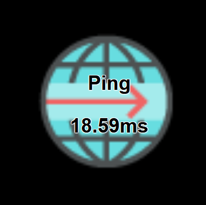

Shows ping times to a server.
Here you can test your connection to a server. Ping will test the connection to a server, You can use an IP Address or a server name (without any http...) If you put this command to an display action you can set a period so that the command will automatically start every #period seconds a test.  The result is the actual ping time in ms.

`type`: `PING`

Parameter:

`name`: the URL to ping to. You can use the Internet address name (without the protocol) or a simple IP address
`period`: the period in seconds when the command should automatically be executed. 

#### Random words


Choose a random word/phrase out of a list

`type`: `RNDWORDS`

`Parameter`: 
`words`: The list of words/phrases to choose one randomly from

#### Screen shot

taking a screen shot.

With this command, you can take a screen shot. 

`type`: `SCREENSHOT`

Parameter:
`saveto`: the folder, where the screen shot will be saved. File name format is `screen_<#number>_<display>.png`
`display`: optional, the number of the display, if you want to store screen shot of every display please use -1. Getting the right display, simply do a screen shot with display = -1. Than look at the screen shots and look in the name at the last number of the right image. That is your display.

#### Send message

`type`: `SENDMESSAGE`

Parameter:

`receiver`: the receiver of this message. `client` is for all clients having this particular action active, `service` is for the service itself. (Or more the user sitting on the service related desktop)
`message`: the message to send

#### Show text

Showtext will show a text on the button, and the icon of this command, if set, will be displayed as the title, too. 

`type`: SHOWTEXT

Parameter:
`text`: the text to show in the text field of the button. 

#### Start Browser

`type`: `BROWSE`

Parameter:

`url`: the URL to show in the system browser. On Windows if you choose a normal file system folder, it will automatically start the explorer on this path.

Example 1

start a new browser windows with a url:

```yaml
url: https://www.wk-music.de
```

Example 2

on windows: start a new explorer windows with a filepath

```yaml
url: c:\windows
```


#### Stopwatch

A simple textual stopwatch.

`type`: `STOPWATCH`

`Parameter`: 

`format`: the format of the time. The `%` character signifies that the next character is a  modifier that specifies a particular duration unit. The following is the full list of modifiers supported by go-durationfmt:

- `%y` - # of years
- `%w` - # of weeks
- `%d` - # of days
- `%h` - # of hours
- `%m` - # of minutes
- `%s` - # of seconds
- `%%` - print a percent sign

You can place a `0` before the `h`, `m`, and `s` modifiers to zeropad those values to two digits. Zeropadding is undefined for the other modifiers.

#### Timer

Starting a timer with a response every second. You can define the format of the timer message and the message on finish.

`type`: TIMER

`Parameter`: 

`time`: time to delay in Seconds
`format`: the message for the response, defaults %d seconds
`finished`: the message at the end of the timer, defaults: finished

#### WindowCtrl

Controlling Application Main Window.

With this command, you can control the main window of an application.

`type`: `WINDOWCTRL`

Parameter:
`caption`: the caption of the application window
`command`: the command to execute on this window. Possible values are:
	`minimize`: for minimizing the application window
	`activate`: for activating the application window again. (restore it if minimized and active/bring it to front) 
	`move  x y`: moving the window to the new position x,y

# Installing 3'rd Party products

For other 3'rd party products there is an so called integration for accessing the different parts. Here you can find some remarks on these integration.  

## Elagto Stream Deck (c)

The stream deck integration instrumented an Elgato stream deck for the ReCoS system. Since only one application can access the hardware, it is necessary that you deactivate and close the original stream deck application. You can then simply activate the stream deck integration in the section settings in the admin client.

 

The second parameter is optional. You can add here the profile, the stream deck will present. But there are defaults for it. For a normal stream deck (15 Button version, no matter whether revision 1 or 2) the default profile is called `streamdeck`. A profile with the name `streamdeck_mini` is expected for the Stream deck mini. The `streamdeck_xl` profile is expected for the XL. The following applies to all three, if the profile is not found and no profile is specified, the `default` profile is used. So that the profiles in the surface correspond to the display in the stream deck, you should create the rows and columns accordingly. For the normal stream deck the configuration is 3x5 (rows / cols) for the Mini 2x3 and for the XL 4x8. Other profile configurations also work, but it is possible that not all buttons are displayed on the stream deck or that they remain empty.

## Installation of OpenHardwareMonitor

For hardware sensor reading ReCoS uses the OpenHardwareMonitor Software. (https://openhardwaremonitor.org/) To use this, simply install the software. After installation, go to Option/Remote Web Server/Port. 

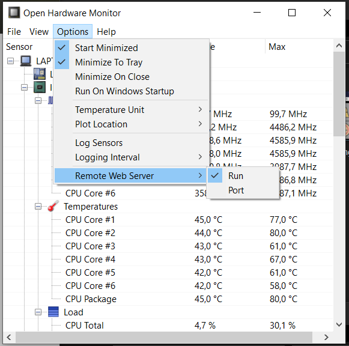


As Port number enter 12999 (which is the default for Combination of ReCoS and OHM)

After that simply activate the OHM Web server via Option/Remote Web Server/Run.
The OHM should be available after restart of windows, so please tick the following options on. Now everything of the OHM side is ready. The ReCoS service will now automatically connect to the OHM and get all Sensors. 


If you have already installed the OHM (maybe for another App) and you can't reconfigure the port option, you can simply change the port for ReCoS in the admin client. Same for the url, when you want to get sensors from another Computer.


## Installation Philips Hue

First of all, a new user must be created for the ReCoS installation. To do this, please start your browser and go to the clip page of your Hue Bridge. 

http: // <IP address of the Hue Bridge> /debug/clip.html


Now please post the following to the bridge.
URL: /api

Message Body: {"devicetype":"recos#hue_user"}

With the first attempt an error message appears.


Please press the big button on the Philips Hue Bridge and post the same thing again.

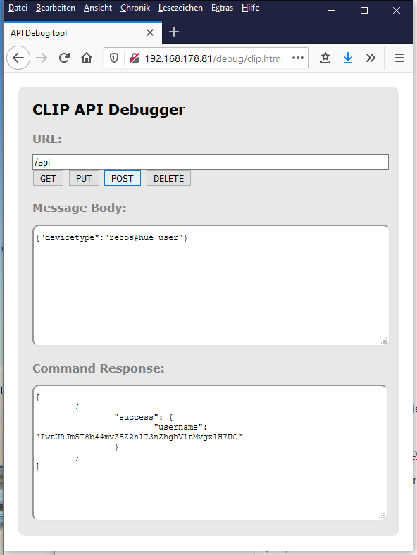

Then copy the username from the answer:


Now you have to change the ReCoS configuration. To do this, please start the admin client via the context menu.

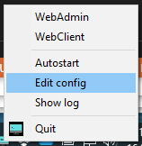

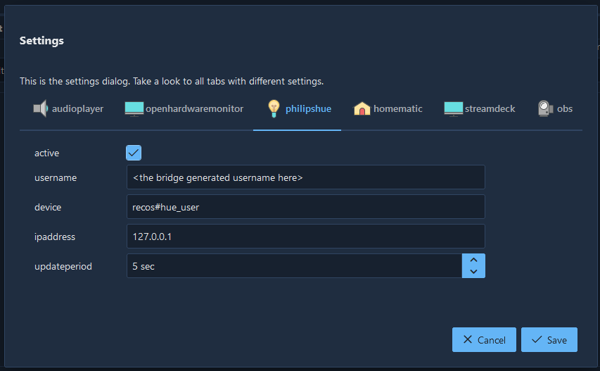Please enter the generated user name here as the `username` and change the `ipaddress` accordingly.
`updateperiod` is the time span in seconds in which ReCoS polls the bridge for changes.

## Homematic

For using the Hometmatic system for commands, you simply have to do 2 Things:
First you have to add the xmlapi addon to your homematic. 
https://github.com/homematic-community/XML-API

Second: add the url of your homematic system in the system config (via admin client/settings) and set the active state to true. After a redstart of the ReCoS you can use the homematic commands. 

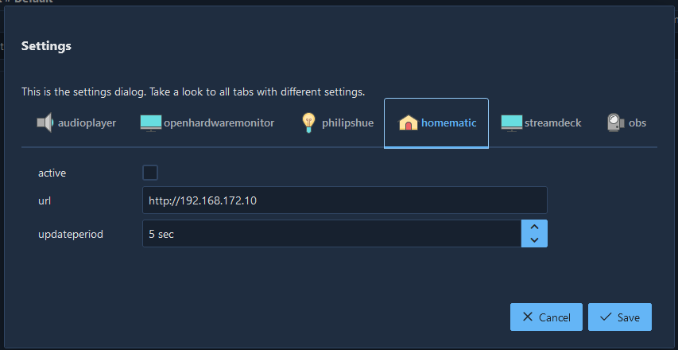

## OBS Studio - Open Broadcaster Software

With ReCoS you can control some parts of your OBS Software.  This integration supports the OBS Studio. First you have to install the obs-websocket plugin.  At the moment only the version 4.9.0 is supported. (https://github.com/Palakis/obs-websocket/releases/tag/4.9.0) 

To activate the integration simply go to the settings page.

The host is the pc where the obs is installed. Normally this is the same pc, so 127.0.0.1 should work. The default port is 4444. (If you don't change it in the settings of the plugin) On the password field use the password you setup in the plugin settings (or leave it empty, if no password was been set.)

Thats all for setting up the integration.

# For the nerds

## Profile configuration

Every profile has it's own configuration file. The file is usually located in the Profiles folder. This file is written in yaml and has the following sections:

In the root you will find the following parameters

`name`: The name of the profile
`description`: a user readable description
`pages`: This are the different pages for showing up the actions
`actions`: a list of different actions. An action can appear on different pages. But as it's the same action, the status/result will be the same.

This is an example

```yaml
name: default
description: This is the default configuration, just to have one starting point
pages:
    - name: Default
      description: Some default command for every operating system
      columns: 3
      rows: 2
      toolbar: ""
      cells:
        - Hello_World
        - clocks
        - timer
        - analogclock
        - cpuload
        - stopwatch
    - name: clocks
      description: clocks only
      columns: 2
      rows: 2
      toolbar: hide
      cells:
        - Back
        - none
        - clock
        - analogclock
actions:
    - type: SINGLE
      name: Hello_World
      title: Hello World
      icon: chat.png
      description: Execute notepad and wirte Hello ReCoS to it.
      fontsize: 0
      fontcolor: ""
      outlined: false
      runone: true
      commands:
        - id: EXECUTE_0
          type: EXECUTE
          name: execute
          description: ""
          icon: ""
          title: ""
          parameters:
            args: []
            command: notepad.exe
            waitOnClose: false
        - id: DELAY_1
          type: DELAY
          name: delay
          description: ""
          icon: ""
          title: delay
          parameters:
            time: 3
        - id: KEYS_2
          type: KEYS
          name: typeit
          description: ""
          icon: ""
          title: typeit
          parameters:
            keys: Hello ReCoS
            layout: de
      actions: []
    - type: SINGLE
      name: clocks
      title: Clocks
      icon: clock.png
      description: Goto clocks page
      fontsize: 0
      fontcolor: ""
      outlined: false
      runone: true
      commands:
        - id: PAGE_3
          type: PAGE
          name: page
          description: ""
          icon: ""
          title: ""
          parameters:
            page: clocks
      actions: []
    - type: SINGLE
      name: timer
      title: Timer 10 sec
      icon: alarm_bell.png
      description: timer counting down 10 sec
      fontsize: 0
      fontcolor: ""
      outlined: false
      runone: true
      commands:
        - id: TIMER_4
          type: TIMER
          name: timer
          description: ""
          icon: ""
          title: ""
          parameters:
            finished: Fertig
            format: noch %ds
            time: 10
      actions: []
    - type: DISPLAY
      name: analogclock
      title: Analogclock
      icon: ""
      description: ""
      fontsize: 0
      fontcolor: white
      outlined: false
      runone: true
      commands:
        - id: CLOCK_5
          type: CLOCK
          name: clock
          description: ""
          icon: ""
          title: ""
          parameters:
            analog: true
            format: "15:04:05\r\n02 Jan 06"
      actions: []
    - type: SINGLE
      name: screenshot
      title: Screenshot
      icon: monitor.png
      description: doing a screenshot
      fontsize: 0
      fontcolor: ""
      outlined: false
      runone: true
      commands:
        - id: SCREENSHOT_6
          type: SCREENSHOT
          name: screenshot
          description: ""
          icon: ""
          title: ""
          parameters:
            display: 1
            saveto: e:/temp/screenshot
      actions: []
    - type: DISPLAY
      name: cpuload
      title: CPU Load
      icon: company.png
      description: cpu usage
      fontsize: 0
      fontcolor: white
      outlined: false
      runone: true
      commands:
        - id: HARDWAREMONITOR_7
          type: HARDWAREMONITOR
          name: cpu
          description: ""
          icon: ""
          title: ""
          parameters:
            color: '#ffff00'
            display: both
            format: '%0.1f %'
            sensor: CPU/Intel Core i7-6820HQ/Load/CPU Total
      actions: []
    - type: SINGLE
      name: stopwatch
      title: Stopwatch
      icon: timer.png
      description: simple stop watch
      fontsize: 0
      fontcolor: black
      outlined: true
      runone: true
      commands:
        - id: STOPWATCH_8
          type: STOPWATCH
          name: stp1
          description: ""
          icon: ""
          title: ""
          parameters:
            format: 'Mom: %0m:%0s'
      actions: []
    - type: SINGLE
      name: clock
      title: text clock
      icon: clock.png
      description: ""
      fontsize: 0
      fontcolor: ""
      outlined: false
      runone: false
      commands:
        - id: CLOCK_9
          type: CLOCK
          name: clock
          description: ""
          icon: ""
          title: clock
          parameters: {}
      actions: []
    - type: SINGLE
      name: Back
      title: ""
      icon: ""
      description: ""
      fontsize: 0
      fontcolor: ""
      outlined: false
      runone: false
      commands:
        - id: PAGE_10
          type: PAGE
          name: Back
          description: ""
          icon: ""
          title: Back
          parameters:
            page: Default
      actions: []

```

