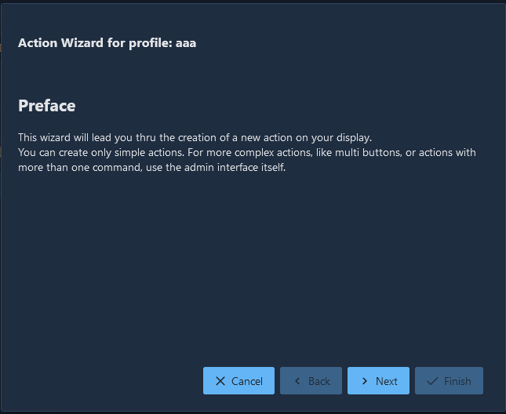
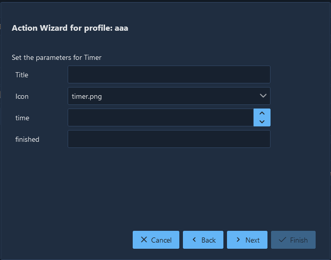
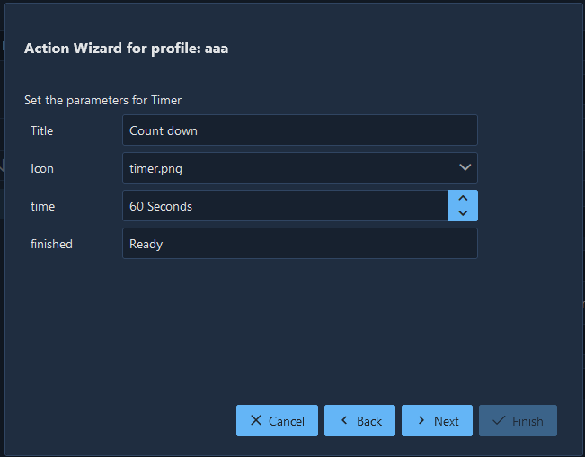
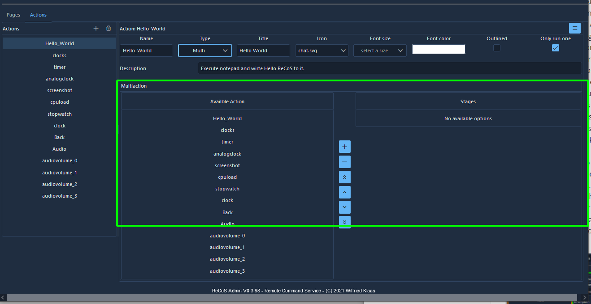
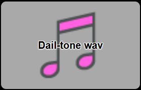
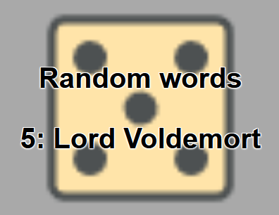
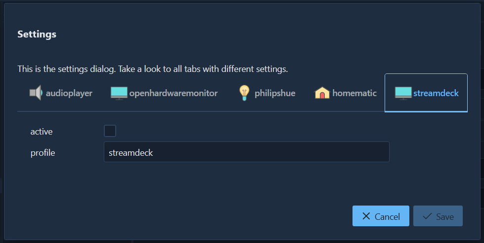
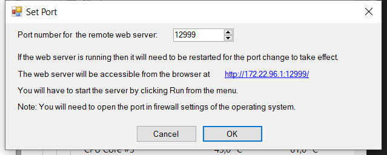
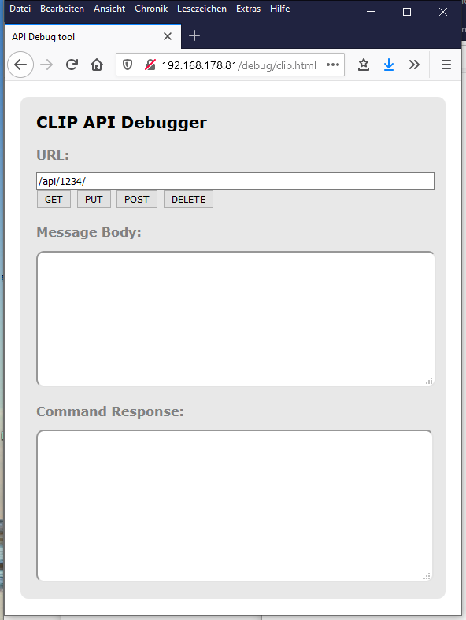
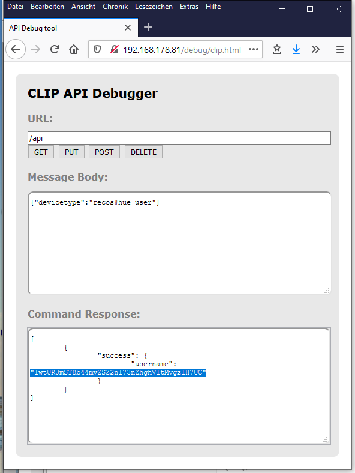

# Remote Command Service, ReCoS

Remote Command Service kurz ReCoS ist ein Programm, um Apps, Programme und Skripte aus der Ferne, von einem anderen Gerät aus, auszuführen zu können. Genau wie eine Makrotastatur, aber mit visuellem Feedback und mehr Interaktion. Du kannst mit deinem Handy oder Tablett auf deinem Rechner Programme starten, Tastatur Makros ausführen oder dir einfach nur die Uhrzeit anzeigen lassen. 
Das Programm besteht aus 3 verschiedenen Komponenten.
Zunächst ist da das Hauptprogramm, ein kleiner Golang-basierter Mikroservice, der alle Funktionen auf dem zu steuernden Rechner bereitstellt. Dieser Dienst läuft gewöhnlich im Hintergrund und sollte automatisch mit dem Rechner gestartet werden.
Auf der anderen Seite gibt es zwei Webanwendungen. 
Einmal der Client, der die Aktionen steuert, der auf dem steuernden Gerät gestartet werden kann, und ein Client der für die Konfiguration zuständig ist.

Folgende Funktionen können gesteuert werden: (Das ist natürlich nur ein Auszug aus den wichtigsten Funktionen)

- Lautstärke und Mikrofon Gain.
- OBS Studio integration: Steure Profile, Szenen und Stream und Aufnahme Funktionen 
- Starte einen Browser, den Explorer oder irgendein anderes Programm auf Tastendruck
- zeige dir ein Uhr in verschiedenen Designs an
- Zähle Ereignisse auf Knopfdruck
- zähle die Tage bis zu einem Ereigniss
- lass die Würfel rollen
- zeige dir Sensordaten deines PC an, CPU/GPU Auslastung oder Temperatur
- Kontrolliere deine Smarthome Produkte wie Homematic(C) oder Philips Hue(C)
- benutze die virtuelle Tastatur und sende belibige Tastenfolgen 
- steuere deinen Media Player
- zeig dir die Netzwerk Ping Zeit zu einem anderen Server an
- mach dein eigenes Soundboard: spiele belibige Mediadateien ab
- zufalls Wörter: lass dir aus einer Liste von Wörter zufällig eines auswählen
- mache einen Screenshot und speichere diesen automatisch in einen Ordner deiner Wahl
- zeige dir eine Stoppuhr an
- benutze einen Countdown-Timer
- Kontrolliere deinen Windows Desktop, aktiviere, verschiebe und minimiere Fenster 

# Installation

Die Installation ist einfach. Führ das Installationsprogramm aus. Nach der Installation startet der Dienst automatisch. Für den automatischen Start musst du nur im Kontextmenü Autostart wählen.


Jetzt kannst du einfach den Admin-Client mit WebAdmin aufrufen.

Für den Client wählst du WebClient. Wenn du den Client auf einem anderen Gerät ausführen möchtest, schau im nächsten Kapitel.

# ReCoS Client - Web Client Interface

## Verbinde ein Gerät

Einen Client zu verbinden ist einfach. Um den Client direkt auf derselben Maschine wie den ReCoS Service zu starten, klicke einfach auf das Task-Icon-Menü für den WebClient.


Wenn Du ein anderes Gerät, wie dein Smartphone oder Tablett, verbinden möchten, musst du dich zunächst mit dem Gerät verbinden, auf dem der ReCoS-Dienst ausgeführt wird, vorrausgesetzt beide Geräte sind im gleichen Netzwerk. Um diesen Vorgang zu vereinfachen, kann dir ReCoS fertige QR Codes für die Verbindung generieren. Dazu starte den Webadmin über das obige Menü. Klicke auf das Hilfemenü und dann auf das Menü Client QR Codes.


Wenn dieser Dialog sichtbar ist, kannst du eine Netzwerkschnittstellen auswählen und den QR-Code dafür scannen. (Falls du keine Möglichkeit hast, einen QR Code auf dem Gerät zu scannen, kannst du auch einfach den Interbrowser auf dem Gerät starten und die Adresse, die unter dem QR Code steht, verwenden.) Nachdem du diesen Code ausgeführt hast, wirst du zur richtigen Webseite weitergeleitet. Wenn es ein Problem gibt, verwende einfach einen anderen Eintrag. (Nicht jede Schnittstelle ist mit deinem Heimnetzwerk verbunden. Einige sind nur für den internen Gebrauch. Das Programm kann aber leider den Unterschied nicht erkennen.)


## Der WebClient

Dies ist der Haupt-ReCoS-Webclient zum Ausführen der konfigurierten Befehle. 


Der Client hat einen großen Schaltflächenbereich, der die verschiedenen Aktionen präsentiert. Aber fangen wir ganz am Anfang an. Zunächst ist alles in einem **Profil** organisiert. Du kannst unterschiedliche Profile für unterschiedliche Clients oder unterschiedliche Szenarien anlegen. Ein Client kann jeweils nur ein Profil präsentieren, aber du kannst verschiedene Profile gleichzeitig in verschiedenen Browsern geöffnet haben. Beispiel: Dukannst dir ein spezielles Profil für dein Telefon, ein Anderes für den Tablett und ein wirklich großes Profile für deinen PC anlegen. Und alle können gleichzeitig aktiv sein. Aber um es noch einmal zu betonen, Du kannst das gleiche Profil auch auf 2 verschiedenen Geräten gleichzeitig betreiben. Beim Starten des Clients wird immer das erste Profil ausgewählt. Du kannst das Profile mit der Profil-Combobox auf der Einstellungsseite auswählen. Zum Öffnen einfach den Button in der oberen rechten Ecke drücken.


Jedes Profil hat unterschiedliche **Seiten** zur weiteren Strukturierung. Beim Starten des Clients wird automatisch die erste Seite ausgewählt. Eine Seite besteht dann aus Zeilen und Spalten. Du kannst die Größe der Seite im Admin-Client einstellen. Je mehr Zeilen und Spalten du hast, desto kleiner werden die einzelnen Aktionen. Die Seite passt ihre Aktionen dem möglichen Raum an. Seiten können direkt über die Einstellungen (dargestellt als Schaltflächen, im Bild oben Default und Audio) oder über spezielle Aktionen geändert werden. Ob eine Seite im Einstellungsdialog erscheint, kann in der Seitenkonfiguration eingestellt werden. Wenn die Seite kein Symbol hat, wird nur der Name angezeigt.

Im Client-Bereich siehst du 2 Arten von Schaltflächen und möglicherweise etwas Leerraum. Zunächst sind da die grau hinterlegten Tasten, die Du drücken kannst. (**Single** Action) Dies ist das Standardverhalten. Beim Drücken wird die zugrunde liegenden Aktion auf dem Computer ausgeführt.

Die schwarz hinterlegten Schaltflächen dienen nur zur Anzeige. (**Display** Action) Dort werden Systemzustände oder andere Parameter angezeigt.

Die leeren Felder warten darauf, das Du dort eine Aktion zuordnest.

(Wenn Du ein Feld mit der roten Warnung „Action not defined“ siehst, liegt eine Fehlkonfiguration vor. Möglicherweise hast Du eine Aktion gelöscht und vergessen diese von der Schaltfläche zu entfernen.)


Schaltflächen oder Aktionen können mehrere Zustände haben. Je nach Situation werden dort dann unterschiedliche Icons angezeigt. Wenn ein Befehl aktuell ausgeführt wird, wird normalerweise die Sanduhr angezeigt. Bei mehreren Kommandos pro Aktion zeigt die Stellung der Sanduhr an, wie viele Befehle gerade ausgeführt worden sind. (Ja, Aktionen können eine Befehlsliste enthalten)

Besondere Aktionen: Bei sogenannten **Multi**-Aktionen durchläuft die Aktion eine Liste von anderen Aktionen. Die 1. Aktion wird beim 1. Drücken ausgeführt, die 2. beim 2. Drücken und so weiter. Der jeweilige Status wird durch das Symbol der entsprechenden Aktion dargestellt.

Wie bereits erwähnt, kann eine Aktion mehrere Befehle enthalten. (Die Aktion "Hello World" von der Demo enthält z.B. 3 Befehle: Notepad starten, einige Sekunden warten, "Hello ReCoS" schreiben)

# ReCoS Admin - Die Konfiguration

Der WebAdmin dient zur Konfiguration des ReCoS Systems. 

Alle modifizierenden Funktionen sind mit einem Passwort geschützt. Dieses Passwort kannst du im WebAdmin festlegen. Das Standardpasswort ist `recosadmin`. Zum Ändern gehst du auf das Icon rechts oben und wählst Settings


Im folgende Dialog findest du die Passworteinstellung ubter dem Reiter ReCoS Password


Wie üblich musst du hier sowohl dein altes Passwort wie auch 2x dein neues Passwort eingeben. Um die Passwortprüfung zu deaktivieren, benutze einfach ein leeres Passwort.

## Action Wizard

Mit dem Aktionsassistenten könnst du schnell und einfach neue Aktionen erstellen. Mit dieser Schaltfläche starten Sie den Aktionsassistenten.


Oder im Schaltflächenzuordnungsdialog:


Zuerst siehst du diese Vorwortseite:



Auf der nächsten Seite kannst du den Befehl auswählen, der generiert werden soll. Du kannst das Suchfeld verwenden, um die Liste der Befehle zu filtern.


Weiter mit Next.
Im nächsten Dialog kannst du einige Angaben zum Befehl machen. Du kannst der Schaltfläche einen Titel geben, ein Symbol zuweisen (eine Vorgabe wird direkt durch den Befehl vorgegeben) und du kannst je nach Befehl verschiedene andere Einstellungen vornehmen. Weiter mit Next.





Auf dieser letzten Seite kannst du festlegen, wo die Aktion angezeigt werden soll. Du kannst hier die bereits vorhandenen Seiten auswählen oder eine neue Seite erstellen. Klicke einfach auf einen freien Button, auf dem die Aktion gespeichert werden soll. Mit Finish wird jetzt die Seite und das Profil gespeichert.


Im Admin Client im Bereich Actions siehst du dann, was der Assistent generiert hat.


## Erzeugung eine neuen Profiles


Über den Menüpunkt Add im Profile Menü kann ein neues Profile angelegt werden.


Hier kannst Du einen Namen und eine Beschreibung hinterlegen. Über template können vordefinierte Profile erzeugt werden. Diese beinhalten dann neben Name und Beschreibung auch bereits fertig konfigurierte Seiten und Aktionen. Somit kannst Du z.B. für dein Streamdeck schnell ein Profile erstellen. 

## Austauschen von Profilen, Aktionen und konfigurierten Seiten

Ihr könnt sowohl ganze Profile, Seiten wie auch einzelne Aktionen exportieren und auch wieder importieren. (z.B. um Sie mit Freunden zu teilen) Bei verschiedenen Aktionen müsst ihr euch aber versichern, dass die Aktionen nach einem Import noch funktionieren. Bei dem Kommando "Programm ausführen" steht üblicherweise der Pfad zu der ausführbaren Datei in der Konfiguration. Dieses kann natürlich auf deinem System ein anderer sein als der auf dem System deines Freundes. 

# ReCoS Service

Der Service ist der Hauptbestandteil des ReCoS. Der Service ist die Stelle, die all die schönen Dinge tut. Allerdings siehst du davon nur ein kleines Symbol in der Taskleiste. Und dort gibt es ein kleines Kontextmenü.


- **WebAdmin, WebClient**: Du kannst direkt das Webinterface oder den Admin-Client starten. 
- **Autostart:** Du kannst den Dienst so registrieren, dass er beim Windows-Start automatisch gestartet wird. 
- **Edit config:** Die nächste Option besteht darin, die Datei service.yaml zu bearbeiten, die die gesamte Konfiguration für den Dienst selbst enthält. Normalerweise brauchst du hier nichts zu tun, aber nur für den Fall... 
- **Show log:** Ähnliches gilt für das Log. 
- Mit **Help (Hilfe)** bist du bestimmt hier hin gekommen. 
- Und **Restart** startet den Service neu. 
- **Quit:** Der letzte Menüeintrag dient zum Beenden des Dienstes.

## Profilkonfiguration

Im ReCoS können verschiedene Profile hinterlegt werden. Jedes Profil besteht zum einen aus einer Liste von Aktionen und zum anderen aus den Seiten, die diese Aktionen auf einer Oberfläche repräsentieren. Jedes Profil hat einen Namen und eine Liste von Aktionen und Seiten.

`name`: Der Name des Profils
`description`: eine vom Benutzer lesbare Beschreibung
`pages`: Dies sind die verschiedenen Seiten zum Anzeigen der Aktionen
`actions`: eine Liste verschiedener Aktionen. Eine Aktion kann auf verschiedenen Seiten erscheinen. Da es sich jedoch um dieselbe Aktion handelt, ist der Status/das Ergebnis gleich.


### Seiten

Eine Seite ist eine Ansichtskomponente, die mit Zeilen und Spalten angezeigt wird. Jede dieser Zellen visualisiert dann eine Aktion. Die Zellenliste wird über den Namen in der Aktionsliste mit einer Aktion verknüpft. Der Index einer Aktion einer Zelle wird berechnet als

`index = (cell.row * page.rows) + cell.column`

Parameter:

`name`: Der Name der Seite
`icon`: das Icon dieser Seite
`rows`: Anzahl der Zeilen auf der Seite
`columns`: Anzahl der Spalten auf der Seite
`toolbar`: `show`, diese Seite erscheint in der Toolbar, um direkt zu wechseln, `hide`, wenn diese Seite in der Toolbar erscheinen soll. Mit dem Seitenbefehl können Sie auf diese Seite wechseln.
`cells`: Liste der Namen der Aktion pro Zelle (Im UI als Buttonfeld angezeigt)


### Aktionen

Eine Aktion ist der Teil, der definiert, was zu tun ist, wenn eine Schaltfläche ausgelöst wird.

Folgende Parameter werden verwendet:

**`Name`**: ist der Name der Aktion
**`Type`**: **`SINGLE`** ist eine Einzelaktion. Die Aktion startet immer die Befehlsliste.
**`DISPLAY`** ist für die reine Anzeige. Es werden nur Text, Symbole oder Bilder angezeigt, Du kannst jedoch nicht damit interagieren.
**`MULTI`** ist die dritte Option. Hier kannst du  mehrere Schritte definieren und auf jedem Schritt eine Aktion definieren, die beim Aktivieren dieses Schrittes ausgelöst wird. 
**`Title`**: der Titel der Aktion, die von der Benutzeroberfläche verwendet wird
**`Description`:** benutzerdefinierte Beschreibung dieser Aktion
**`Icon`:** das Symbol, das auf der Zelle angezeigt wird
**`Fontsize`:** die Größe des Titels und des Textes, standardmäßig 14
**`Fontcolor`:** die Farbe des Titels und des Textes, standardmäßig schwarz
**`Outlined`:** wahr oder falsch, manchmal ist das Lesen eines schwarzen Textes auf schwarzem Grund etwas schwierig. Outline  kann dort helfen.
**`Only run once`:** ist wahr oder falsch. Wenn "runonce" wahr ist und die Aktion zweimal ausgelöst wird, müssen alle Befehle der ersten Ausführung beendet sein, bevor die zweite Ausführung stattfindet. Bei false wird die Ausführung direkt gestartet, ohne den vorherigen Ausführungsstatus der Aktion zu überprüfen. Evtl. laufen dann beide Ausführungen parallel.
**`Commands`:** Liste der Befehle zur Ausführung dieser Aktion
**`Actions`:** Gilt nur in einer MULTI-Aktion. Für jede Stufe sollte der Name der Aktion stehen, die aufgerufen wird, wenn die Stufe ausgeführt wird. Wird eine Stufe ausgeführt, wird das Icon der zuletzt ausgeführten Aktion (Stufe) als Icon der Multiaktion angezeigt und der Titel wird in der Textzeile angezeigt.




### Commands

Commands sind die Kommandos, also der Teil, der ausgeführt wird. Dies sind die Einstellungen, die in allen Befehlen gleich sind.

**`Name`:** benennt den Befehl
**`Title`:** ein Text, der angezeigt wird, wenn dieser Befehl ausgeführt wird
**`Type`:** der Typ des Befehls
**`Icon`:** ein Icon, das beim Ausführen dieses Befehls angezeigt wird
**`Description`:** eine vom Benutzer lesbare Beschreibung
Die anderen Parameter sind von Befehl zu Befehl verschieden.


#### No Operation

Tut nichts. (Du kannst aber den Text und das Symbol ändern ;-) )

`Type`: `NOOP`

`Parameter`: keine

#### Audiocontrol

Übernimmt die Kontrolle über Ihre Audiogeräte.

Mit diesem Befehl können Sie verschiedene Audiogeräte steuern,  Einstellen von Lautstärke oder Stummschaltung.

`type`: `AUDIOVOLUME`

Parameter:
`device`: das Gerät, das Sie steuern möchten. Es gibt verschiedene Geräte in Ihrem System. Welche Sie auswählen können, sehen Sie in der Admin-Oberfläche. Es gibt 2 Voreinstellungen: `master` für den Master-Ausgang. Dies ist bei Windows diejenige, die Sie direkt mit dem Taskleistensymbol steuern können. Und `mic`, welches das Standardeingabegerät darstellt.
`Befehl`: Dies ist der Befehl, den Sie abfeuern möchten. `mute`, um den Mute-Status umzuschalten. `volume up` zum Erhöhen und `volume down` zum Verringern der Lautstärke dieses Geräts.

#### Clock


Nur eine Uhr in verschiedenen Designs.

`Type`: `UHR`

`Parameter`:

`format`: das Format der Uhrzeit in der Golang-Format-Syntax, Standardwerte: 15:04:05
`timezone:` String mit dem Namen der Zeitzone der IANA Timezone Database (https://en.wikipedia.org/wiki/List_of_tz_database_time_zones), die verwendet werden soll.
`dateformat`: das Format des Datums in der Golang-Format-Syntax, das von verschiedenen Designs verwendet wird, Standardwerte: 02.01
`graphical`: wahr oder falsch, zeigt eine analoge Uhr an
`showseconds`: Zeigt die Sekunden im Design an.
`showdate`: Zeigt das Datum im Design formatiert mit dateformat an.
`design`: das Design der Uhr. `analog` steht für eine analoge Uhr, `digital` zeigt eine schöne Digitaluhr, `berlin` zeigt die Berliner Uhr (https://en.wikipedia.org/wiki/Mengenlehreuhr).
Es gibt eine weitere Berliner Uhr namens `berlin2`, die im SVG-Format erstellt wurde. Diese ist besser für kleinere Auflösungen.
`color`: die Farbe der Segmente der Digitaluhr

Beispiel 1: einfache Textuhr

Parameter:

```yaml
format: "15:04:05 02 Jan 06"
```

Beispiel 2: zeigt eine schöne Digitaluhr mit roten 7-Segment-Ziffern

```yaml
format: "02-01"
design: digital
showseconds: true
color: "#ff0000"
```

#### Counter


Ein einfacher Zähler mit bleibendem Wert.

`Typ`: `ZÄHLER`

`Parameter`:
`persist`: wahr oder falsch, wenn wahr, bleibt der Zähler zwischen Dienstneustarts bestehen
`oldschool`: Rendering eines Old-School-Zählers mit 7-Segment-Ziffern
`color`: die Farbe der Segmente

#### Days remain


Zeigt die verbleibenden Tage bis zu einem Enddatum an.

`type`: `DAYSREMAIN`

`Parameter`:

`date`: Enddatum im Format "yyyy-mm-dd"
`formatTitle`: die Titelnachricht für die Antwort, Standardwerte %d
`formatText`: die Textnachricht für die Antwort, Standardwerte %d
`finished`: die Nachricht am Ende der Tage bleibt, Standard: finished

#### Delay

Verzögert die Ausführung. Hiermit kann man 2 Kommandos, die in einer Aktion hintereinander kommen sollen, um eine gewisse Zeit verzögern.

`type`: `DELAY`

`Parameter`: 

`time`: die Verzögerung in Sekunden

#### Dice


Eine einfache Würfelimplementierung mit schöner Benutzeroberfläche und verschiedenen Werten.

`type`: `DICE`

`Parameter`: 
`sides`: die Anzahl der Seiten des Würfels. Für Seiten <= 9 ist eine Benutzeroberfläche implementiert.

#### Execute

`type`: `EXECUTE`

Parameter:

`command`: die ausführbare Datei oder das auszuführende Shell-Skript, mit oder ohne Pfad
`args`: Liste der String-Argumente für diese ausführbare Datei
`waitOnClose`: Wartet mit der weiteren Ausführung, bis die ausführbare Datei geschlossen oder das Skript beendet ist.

#### Hardware monitor


Dieser Befehl stellt eine Verbindung mit der Openhardware-Monitoranwendung unter Windows her. Damit können Sie Werte verschiedener Sensoren Ihres Computers erhalten. Um den Webserver der openhardwaremonitor App nutzen zu können, müssen Sie in den Einstellungen die Open Hardware Monitor Integration aktivieren. Die `URL` ist die URL zum App-Webserver, der mit data.json hinzugefügt wurde. `updateperiod` ist die Aktualisierungszeit in Sekunden.

Wenn Sie dies konfiguriert haben, wertet der Dienst beim Start die Verbindung und alle möglichen Sensornamen aus. Diese Namensliste sehen Sie im Log und im Konfigurationsverzeichniss gibt es eine Datei sensorlist.txt mit allen Sensornamen. Der Sensorname beginnt mit der Kategorie, wie CPU, GPU oder Speicher, gefolgt von der Hardwarekomponente. Danach folgt der Sensortyp wie Clocks, Temperatures oder Load, gefolgt vom Sensornamen.

`type`: `HARDWAREMONITOR`

Parameter:
`sensor`: der Sensorname.
`format`: der Formatstring für die textuelle Darstellung
`display`: Text, Grafik, Text zeigt nur die Textdarstellung, Grafik zeigt beides
`ymin`: der Wert für den Boden des Graphen
`ymax`: der Wert für den unteren Rand des Graphen
`color`: Farbe des Graphen

#### Homematic

Zur Einbindung eines homematic Systems in den ReCoS gibt es 3 verschiedene Befehle.

Zuerst müssen Sie Ihre homematic in der Servicekonfiguration konfigurieren. (Siehe Homematic installieren)

Danach können Sie die 3 Befehle verwenden:

Das Starten eines Programms (**program**) ist sehr einfach: Verwenden Sie einfach den Namen als Namen für das Programm.

`name` ist der Name des hm-Programms.

Ein **Switch** dient zur Verwendung der Taste als Schalter. Einfach an/aus. Für beide Zustände können Sie ein anderes Symbol hinzufügen. Das Textfeld der Schaltfläche zeigt immer den aktuellen Zustand an. (Auch wenn Sie das Gerät über andere Software-/Hardwarelösungen wechseln)

`name` ist der Name des "Geräts: Kanal".

`officon`: das Symbol wird angezeigt, wenn der Schalter ausgeschaltet ist

`onicon`: Das Symbol wird angezeigt, wenn der Schalter eingeschaltet ist.

Für **dimmer** und **shutter** können Sie den dritten Befehl verwenden.
`name` ist das Gerät/der Kanal.
`action`: kann die verschiedenen Aktionen haben:
   `set value`: Wert direkt einstellen (in Prozent)
   `up`: Erhöht den Wert in Prozentschritten. Die Schrittweite ist über `value` konfigurierbar.
   `down`: Verringern des Wertes in Prozentschritten. Die Schrittweite ist über `value` konfigurierbar.
`value`: der Wert oder die Schrittweite.

Für alle Befehle ist es erforderlich, dass die Namen der Geräte/Kanäle eindeutig sind.

#### Keys

Senden von Tastaturbefehlen an die aktive Anwendung. Dieser Befehl emuliert eine Tastatureingabe, indem er Tastenanschläge einer Tastatur an die aktive Anwendung sendet. Sie können verschiedene Tastaturlayouts verwenden und es gibt einige Makros, die Sondertasten definieren.

`type`: `KEYS`

`keylayout`: Definiert das Layout der Tastatur, die zum Senden der Daten verwendet wird. en für Englisch (us) "qwerty" und de für ein deutsches "qwertz"-Tastaturlayout. Standard ist "de"

`keystrokes`: sind die Zeichenfolgen mit den Tasten, die zum Senden verwendet werden. Für Sondertasten sind spezielle Makros definiert. Jedes Makro beginnt mit einem "{" und endet dann mit "}". Wenn Sie das "{" als Zeichen senden möchten, verdoppeln Sie dies einfach. ("{" -> "{{").

Ein weiteres spezialisiertes Zeichen ist das Zeichen "~". Dies führt zu einer Verzögerung von 1 Sekunde zwischen den Eingaben. Um das Zeichen "~" zu erhalten, verdoppeln Sie es einfach.

Folgende Makros sind definiert:

| Macro               | Keyboard key          |
| ------------------- | --------------------- |
| backspace, bs, bksp | backspace             |
| break               | break                 |
| capslock            | caps lock             |
| del, delete         | delete                |
| down                | arrow down            |
| end                 | end                   |
| enter               | enter                 |
| esc                 | esc                   |
| help                | help                  |
| home                | home                  |
| ins, insert         | insert                |
| left                | arrow left            |
| num                 | num lock              |
| pgdn                | page down             |
| pgup                | page up               |
| prtsc               | print screen          |
| right               | arrow right           |
| scrolllock          | scroll lock           |
| tab                 | tab                   |
| up                  | arrow up              |
| f1 .. f12           | function key 1 ... 12 |

#### Mediacontrol

die Kontrolle über Ihren System-Media-Player übernehmen. Mit diesen Befehlen können Sie den Mediaplayer des Systems steuern. Unter Windows kann mit diesen Befehlen normalerweise das aktuell gestartete Medienprogramm wie Windows Media Player, Spotify oder auch vlc gesteuert werden.

Die verfügbaren Befehle sind Start, Stop, Next und Previous.

`type`: `MEDIAPLAY`

Parameter:
`command`: Dies ist der Befehl, den Sie abfeuern möchten. `start`, startet den Mediaplayer oder pausiert ihn, wenn er bereits gestartet ist. `stop` um den Player zu stoppen und `next` und `previg` um zum nächsten/vorherigen Teil zu gehen.

#### OBS - Open Broadcaster Software

Dies ist eine Reihe von Befehlen, um Ihre obs-Installation zu steuern.

##### OBS Start/Stop

Start/Stop Aufnahme oder Streaming

`type`: `OBSSTARTSTOP`

Parameter:
`mode`: `recording` oder `streaming`, the mode to start/stop

##### OBS Profile

ändert das aktuelle Profil von OBS

`type`: `OBSPROFILE`

Parameter:
`profile`: der Name des zu aktivierenden Profiles

##### OBS Scene Collection

ändert die aktuelle Scenenkollection 

`type`: `OBSSCENECOLLECTION`

Parameter:
`scenecollection`: der Name Scenenkollektion

##### OBS Scene 

ändert die aktuelle Szene mit verschiedenen Kommandos.

`type`: `OBSSCENE`

Parameter:
`scenecommand`: das Szenenkommando, möglich sind:

- `next`: wechselt zur nächsten Szene in der Liste, am Ende wechselt es wieder zur 1. Szene
- `previous`: wechselt zur vorherigen Szene in der Liste, am Anfang wechselt es wieder zur letzten Szene
- `first, last`: wechselt direkt zur 1. oder letzten Szene in der Liste
- `switch`: wechselt zur der Szene mit dem angegebenen Namen

#### Page

Wechselt zu einer anderen Seite im ReCoS UI.

`type`: `PAGE`

Parameter:
`page`: Name der Seite zu der gewechselt werden soll.

#### Philips Hue 

enthält 2 Kommandos zur Kontrolle von Philips Hue.

##### Philips Hue Lights

`type`: `PHUELIGHTS` 

Parameter:

`name`: der Name des Farbtonlichts, der Gruppe, des Raums oder der Zone. Wird auf eine Leuchte zugegriffen, wird dem Parameter das Schlüsselwort "Licht:" vorangestellt, ansonsten das Schlüsselwort "Gruppe:"
`brightness`: die Helligkeit des Lichts (1..254, 0 für ungenutzt)
`saturation`: die Sättigung des Lichts (1..254, 0 für ungenutzt)
`hue`: der Farbton des Lichts, dies ist ein Farbwert im Bereich von 1..65535, 0 für ungenutzt
`colortemp`: die Farbtemperatur des Lichts, dies ist ein Wert im Bereich von 2000..6500, 0 für unbenutzt
`color`: die Farbe des Lichts

##### Philips Hue Scenes

`type`: `PHUESCENES`

Parameter:

`name`: der Name der hue Gruppe, des Raums oder der Zone.
`Szene`: die Szene, auf die angewendet werden soll
`brightness`: die Helligkeit der Gruppe (1..254, 0 für unbenutzt)

**ACHTUNG**: Da hier Namen der Leuchten, Gruppen, Szenen ... zur Identifizierung des Objekts verwendet werden, achten Sie bitte darauf, dass bei der Definition diese Namen eindeutig sind. Ansonsten kontrolliert ReCoS nur den ersten davon.

#### Play audio



Abspielen einer Audiodatei. Verfügbare Formate sind: wav, mp3, ogg und flac. Mit einer Seite voll von diesen Befehle können Sie Ihr eigenes Soundboard erstellen.

`type`: `PLAYAUDIO`

Parameter:
`file`: Name und Pfad der Audiodatei, die abgespielt werden soll.  

#### Ping


Zeigt einem Server Ping-Zeiten an. 

Hier können Sie Ihre Verbindung zu einem Server testen. Ping testet die Verbindung zu einem Server. Sie können eine IP-Adresse oder einen Servernamen (ohne http...) verwenden. Zeitraum Sekunden ein Test. Das Ergebnis ist die tatsächliche Ping-Zeit in ms.

`type`: `PING`

Parameter:

`name`: die URL zum Pingen. Sie können den Internet-Adressnamen (ohne Protokoll) oder eine einfache IP-Adresse verwenden
`period`: der Zeitraum in Sekunden, in dem der Befehl automatisch ausgeführt werden soll 

#### Random words



Wähle ein zufälliges Wort/eine zufällige Phrase aus einer Liste

`type`: `RNDWORDS`

`Parameter`: 
`words`: Die Liste der Wörter/Phrasen, aus denen man zufällig einen auswählen kann 

#### Screen shot

Mit diesem Befehl können Sie einen Screenshot machen.

`type`: `SCREENSHOT`

Parameter:
`saveto`: der Ordner, in dem der Screenshot gespeichert wird. Das Dateinamenformat ist `screen_<#number>_<display>.png`
`display`: optional, die Nummer des Displays, wenn Sie Screenshots jedes Displays speichern möchten, verwenden Sie bitte -1. Um die richtige Anzeige zu erhalten, machen Sie einfach einen Screenshot mit display = -1. Dann schauen Sie sich die Screenshots an und schauen Sie im Namen auf die letzte Zahl des rechten Bildes. Das ist Ihre Anzeige. 

#### Send message

`type`: `SENDMESSAGE`

Parameter:

`receiver`: der Empfänger dieser Nachricht. `client` ist für alle Clients, die diese spezielle Aktion aktiv haben, `service` ist für den Dienst selbst. (Oder der Benutzer, der auf dem dienstbezogenen Desktop sitzt)
`message`: die zu sendende Nachricht 

#### Show text

Showtext zeigt einen Text auf der Schaltfläche an, und das Symbol dieses Befehls, falls festgelegt, wird auch als Titel angezeigt.

`type`: SHOWTEXT

Parameter:
`text`: der Text, der im Textfeld der Schaltfläche angezeigt werden soll. 

#### Start Browser

`type`: `BROWSE`

Parameter:

`url`: die URL, die im Systembrowser angezeigt werden soll. Wenn Sie unter Windows einen normalen Dateisystemordner auswählen, wird der Explorer automatisch auf diesem Pfad gestartet. 

Beispiel 1 

Starten Sie ein neues Browserfenster mit einer URL: 

```yaml
url: https://www.wk-music.de
```

Beispiel 2

unter Windows: Startet ein neues Explorer-Fenster mit einem Dateipfad

```yaml
url: c:\windows
```


#### Stopwatch

Eine einfache Textstoppuhr.

`type`: `STOPWATCH`

`Parameter`: 

`format`: das Format der Zeit. Das Zeichen `%` bedeutet, dass das nächste Zeichen ein Modifikator ist, der eine bestimmte Dauereinheit angibt. Im Folgenden finden Sie die vollständige Liste der Modifikatoren, die von go-durationfmt unterstützt werden:

- `%y` - Anzahl der Jahre
- `%w` - Anzahl Wochen
- `%d` - Anzahl Tage
- `%h` - Anzahl Stunden
- `%m` - Anzahl Minuten
- `%s` - Anzahl Sekunden
- `%%` - ein Prozentzeichen drucken

Sie können eine `0` vor die `h`, `m` und `s`-Modifikatoren setzen, um diese Werte mit Nullen auf zwei Stellen aufzufüllen. Für die anderen Modifikatoren ist Zeropadding nicht definiert.

#### Timer

Starten eines Timers mit einer Antwort jede Sekunde. Sie können das Format der Timer-Nachricht und der Nachricht bei Beendigung festlegen.

`type`: TIMER

`Parameter`: 

`time`: Verzögerungszeit in Sekunden
`format`: die Nachricht für die Antwort, standardmäßig %d Sekunden
`finished`: die Meldung am Ende des Timers, Vorgabe: finished

#### WindowCtrl

Steuerung des Hauptfensters einer Anwendung.

Mit diesem Befehl können Sie das Hauptfenster einer Anwendung steuern.

`type`: `WINDOWCTRL`

Parameter:
`caption`: die Beschriftung des Anwendungsfensters
`command`: der Befehl, der in diesem Fenster ausgeführt werden soll. Mögliche Werte sind:
	`minimize`: zum Minimieren des Anwendungsfensters
	`activate`: zum erneuten Aktivieren des Anwendungsfensters. (Stellen Sie es wieder her, wenn es minimiert und aktiv ist / nach vorne bringen)
	`move  x y`: Verschieben des Fensters an die neue Position x,y 

# Installieren von Produkten von Drittanbietern

Für andere Produkte von Drittanbietern gibt es eine sogenannte Integration für den Zugriff auf die verschiedenen Teile. Hier finden Sie einige Anmerkungen zu dieser Integration. 

## Elagto Stream Deck (c)

Die Stream-Deck-Integration ist die Brücke zu einem Elgato-Stream-Deck für das ReCoS-System. Da nur eine Anwendung auf die Hardware zugreifen kann, müssen Sie die ursprüngliche Stream-Deck-Anwendung deaktivieren und schließen. Die Streamdeck-Integration können Sie dann einfach in den Abschnittseinstellungen im Admin-Client aktivieren.

 

Der zweite Parameter ist optional. Sie können hier ein Profil hinzufügen, das das Stream-Deck präsentiert. Wird kein Profil ausgewählt. gibt es Voreinstellungen. Für ein normales Streamdeck (15 Button Version, egal ob Revision 1 oder 2) heißt das Standardprofil `streamdeck`. Für das Streamdeck mini wird ein Profil mit dem Namen `streamdeck_mini` erwartet. Für den XL wird das Profil `streamdeck_xl` erwartet. Für alle drei gilt Folgendes: Wenn das Profil nicht gefunden und kein Profil angegeben ist, wird das `default`-Profil verwendet. Damit die Profile in der Fläche der Darstellung im stream deck entsprechen, sollten Sie die Zeilen und Spalten entsprechend anlegen. Für das normale Stream-Deck ist die Konfiguration 3x5 (Reihen / Spalten) für den Mini 2x3 und für den XL 4x8. Andere Profilkonfigurationen funktionieren auch, aber es ist möglich, dass nicht alle Schaltflächen auf dem Stream-Deck angezeigt werden oder leer bleiben.

## Installation von OpenHardwareMonitor

Für das Auslesen von Hardware-Sensoren verwendet ReCoS die OpenHardwareMonitor-Software. (https://openhardwaremonitor.org/) Um dies zu nutzen, installieren Sie einfach die Software. Gehen Sie nach der Installation zu Option/Remote Webserver/Port.




Geben Sie als Portnummer 12999 ein (das ist die Standardeinstellung für die Kombination von ReCoS und OHM)

Danach aktivieren Sie einfach den OHM Webserver über Option/Remote Web Server/Run.
Das OHM sollte nach einem Neustart von Windows verfügbar sein, also kreuzen Sie bitte die folgenden Optionen an. Jetzt ist alles von der OHM-Seite fertig. Der ReCoS-Dienst verbindet sich nun automatisch mit dem OHM und erhält alle Sensoren. 


Wenn Sie das OHM bereits installiert haben (evtl. für eine andere App) und Sie die Port-Option nicht neu konfigurieren können, können Sie einfach den Port für ReCoS im Admin-Client ändern. Gleiches gilt für die URL, wenn Sie Sensoren von einem anderen Computer abrufen möchten.


## Installation Philips Hue

Zunächst muss für die ReCoS-Installation ein neuer Benutzer angelegt werden. Starten Sie dazu bitte Ihren Browser und rufen Sie die Clip-Seite Ihrer Hue Bridge auf.

http: // <IP address of the Hue Bridge> /debug/clip.html



Jetzt bitte folgendes auf die Brücke posten.
URL: /api

Nachrichtentext: {"devicetype":"recos#hue_user"}

Beim ersten Versuch erscheint eine Fehlermeldung.


Bitte den großen Knopf auf der Philips Hue Bridge drücken und das gleiche nochmal posten.


Kopieren Sie dann den Benutzernamen aus der Antwort:



Nun müssen Sie die ReCoS-Konfiguration ändern. Dazu starten Sie bitte den Admin-Client über das Kontextmenü.

Bitte geben Sie hier den generierten Benutzernamen als `Benutzername` ein und ändern Sie die `IP-Adresse` entsprechend.
`update period` ist die Zeitspanne in Sekunden, in der ReCoS die Bridge auf Änderungen abfragt.

## Homematic

Um das Hometmatic-System für Befehle zu verwenden, müssen Sie nur 2 Dinge tun:
Zuerst musst du das xmlapi Addon zu deiner Homematic hinzufügen.
https://github.com/homematic-community/XML-API

Zweitens: Fügen Sie die URL Ihres Homematic-Systems in der Systemkonfiguration hinzu (über Admin-Client/Einstellungen) und setzen Sie den aktiven Zustand auf true. Nach einem Neustart des ReCoS können Sie die homematic-Befehle verwenden.


## OBS Studio - Open Broadcaster Software

Mit ReCoS können Sie einige Bereiche Ihrer OBS-Software steuern. Diese Integration unterstützt OBS Studio. Zuerst müssen Sie in OBS das obs-websocket-Plugin installieren. Zur Zeit wird nur die Version 4.9.0 unterstützt. (https://github.com/Palakis/obs-websocket/releases/tag/4.9.0) 

Um die Integration zu aktivieren, gehen Sie einfach auf die Einstellungsseite.

Der Host ist der PC, auf dem das obs installiert ist. Normalerweise ist dies derselbe PC, also sollte 127.0.0.1 funktionieren. Der Standardport ist 4444. (Wenn Sie ihn in den Einstellungen des Plugins nicht ändern) Verwenden Sie im Passwortfeld das Passwort, das Sie in den Plugin-Einstellungen festgelegt haben (oder lassen Sie es leer, wenn kein Passwort festgelegt wurde.)

Mehr ist für die Einrichtung der Integration nicht zutun.

# For the nerds

## Profile Konfiguration

Jedes Profil hat seine eigene Konfigurationsdatei. Die Datei befindet sich normalerweise im Ordner Profile. Diese Datei ist in yaml geschrieben und hat die folgenden Abschnitte:

Im Root findest Du die folgenden Parameter

`name`: Der Name des Profils
`description`: eine vom Benutzer lesbare Beschreibung
`pages`: Dies sind die verschiedenen Seiten zum Anzeigen der Aktionen
`actions`: eine Liste verschiedener Aktionen. Eine Aktion kann auf verschiedenen Seiten erscheinen. Da es sich jedoch um dieselbe Aktion handelt, ist der Status/das Ergebnis gleich.

Hier ein Beispiel

```yaml
name: default
description: This is the default configuration, just to have one starting point
pages:
    - name: Default
      description: Some default command for every operating system
      columns: 3
      rows: 2
      toolbar: ""
      cells:
        - Hello_World
        - clocks
        - timer
        - analogclock
        - cpuload
        - stopwatch
    - name: clocks
      description: clocks only
      columns: 2
      rows: 2
      toolbar: hide
      cells:
        - Back
        - none
        - clock
        - analogclock
actions:
    - type: SINGLE
      name: Hello_World
      title: Hello World
      icon: chat.png
      description: Execute notepad and wirte Hello ReCoS to it.
      fontsize: 0
      fontcolor: ""
      outlined: false
      runone: true
      commands:
        - id: EXECUTE_0
          type: EXECUTE
          name: execute
          description: ""
          icon: ""
          title: ""
          parameters:
            args: []
            command: notepad.exe
            waitOnClose: false
        - id: DELAY_1
          type: DELAY
          name: delay
          description: ""
          icon: ""
          title: delay
          parameters:
            time: 3
        - id: KEYS_2
          type: KEYS
          name: typeit
          description: ""
          icon: ""
          title: typeit
          parameters:
            keys: Hello ReCoS
            layout: de
      actions: []
    - type: SINGLE
      name: clocks
      title: Clocks
      icon: clock.png
      description: Goto clocks page
      fontsize: 0
      fontcolor: ""
      outlined: false
      runone: true
      commands:
        - id: PAGE_3
          type: PAGE
          name: page
          description: ""
          icon: ""
          title: ""
          parameters:
            page: clocks
      actions: []
    - type: SINGLE
      name: timer
      title: Timer 10 sec
      icon: alarm_bell.png
      description: timer counting down 10 sec
      fontsize: 0
      fontcolor: ""
      outlined: false
      runone: true
      commands:
        - id: TIMER_4
          type: TIMER
          name: timer
          description: ""
          icon: ""
          title: ""
          parameters:
            finished: Fertig
            format: noch %ds
            time: 10
      actions: []
    - type: DISPLAY
      name: analogclock
      title: Analogclock
      icon: ""
      description: ""
      fontsize: 0
      fontcolor: white
      outlined: false
      runone: true
      commands:
        - id: CLOCK_5
          type: CLOCK
          name: clock
          description: ""
          icon: ""
          title: ""
          parameters:
            analog: true
            format: "15:04:05\r\n02 Jan 06"
      actions: []
    - type: SINGLE
      name: screenshot
      title: Screenshot
      icon: monitor.png
      description: doing a screenshot
      fontsize: 0
      fontcolor: ""
      outlined: false
      runone: true
      commands:
        - id: SCREENSHOT_6
          type: SCREENSHOT
          name: screenshot
          description: ""
          icon: ""
          title: ""
          parameters:
            display: 1
            saveto: e:/temp/screenshot
      actions: []
    - type: DISPLAY
      name: cpuload
      title: CPU Load
      icon: company.png
      description: cpu usage
      fontsize: 0
      fontcolor: white
      outlined: false
      runone: true
      commands:
        - id: HARDWAREMONITOR_7
          type: HARDWAREMONITOR
          name: cpu
          description: ""
          icon: ""
          title: ""
          parameters:
            color: '#ffff00'
            display: both
            format: '%0.1f %'
            sensor: CPU/Intel Core i7-6820HQ/Load/CPU Total
      actions: []
    - type: SINGLE
      name: stopwatch
      title: Stopwatch
      icon: timer.png
      description: simple stop watch
      fontsize: 0
      fontcolor: black
      outlined: true
      runone: true
      commands:
        - id: STOPWATCH_8
          type: STOPWATCH
          name: stp1
          description: ""
          icon: ""
          title: ""
          parameters:
            format: 'Mom: %0m:%0s'
      actions: []
    - type: SINGLE
      name: clock
      title: text clock
      icon: clock.png
      description: ""
      fontsize: 0
      fontcolor: ""
      outlined: false
      runone: false
      commands:
        - id: CLOCK_9
          type: CLOCK
          name: clock
          description: ""
          icon: ""
          title: clock
          parameters: {}
      actions: []
    - type: SINGLE
      name: Back
      title: ""
      icon: ""
      description: ""
      fontsize: 0
      fontcolor: ""
      outlined: false
      runone: false
      commands:
        - id: PAGE_10
          type: PAGE
          name: Back
          description: ""
          icon: ""
          title: Back
          parameters:
            page: Default
      actions: []

```

