# Remote Command Service, ReCoS

Remote Command Service is used to run apps, programs and scripts remotely from another device. Just like a macro keyboard, but with visual feedback and more interaction. This project consists of 3 different components. 
One is the service, a small golang based micro service, which delivers all the functionality behind the UI. This service is responsible for the execution of the different actions. 
On the other side there are two Web applications, build on top of VUE as the main UI Framework. One is the client controlling the actions, which can be started on the remote control device, one client is for the administration, normally started on the same device as the ReCoS service itself.. 

Features:

- Control Audio Volumes and Mic Gain.
- controlling your obs, profiles, scene collections, scenes and streaming/recording functions
- Execute Browser, File explorer and other Apps
- Showing Date and Time with nice faces
- Counting something, with persistence
- showing Days up to an end date
- rolling a dice (virtually)
- showing and logging pc hardware sensors
- controlling your smart home with product integrations like homematic or philips hue
- using a virtual keyboard
- controlling your media player
- ping time to a server
- soundboard: playing media files
- random words: selecting a random word/phrase
- taking a screen shot and save it to a folder
- stopwatch: measure time
- Count down timer
- controlling your desktop windows. activate/move/minimize

# Installation

Installation is simple. Execute the installer. After installation you have to start the service itself. It's called `recos-service.exe`. Nothing else to do here. After the service is up, simply go to the web page http://localhost:9280/webadmin for the admin client. 

For the normal execution client please use http://localhost:9280/webclient. On other machines simply change localhost to the ip of the computer where the service is running, like http://192.168.178.34/webclient

# ReCoS Client - Web Client Interface

## Connecting a client

Conneting a client is simple. For strting the client directly on the same maschine as the ReCoS Service you can simply click on the taskicon menu for the WebClient.

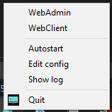

If you want to connect another device,  like your smartphone, you have to connect to the device where the ReCoS Service is running. To simplify this process, start the Webadmin from the menu above.

Then click on the help menu and than on the Menu Client QR Codes.

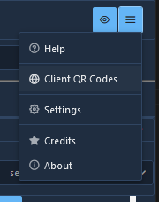

Than this dialog will be visible, you can select one of your network interfaces and scan the QR Code for it. After executing this code, you will be redirected to the right web client. If there is a problem, simply use another entry. (Because not every interface is connected to your home network. Some are for internal use only, so you can't see them outside your PC. )

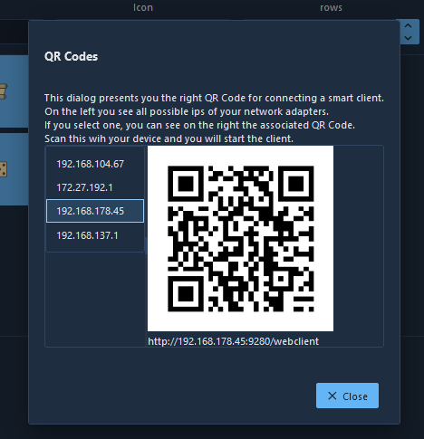

## The client interface

This is the main ReCoS web client for executing the configured commands. After successful installation you can access it with 
http://localhost:9280/webclient on the same computer.

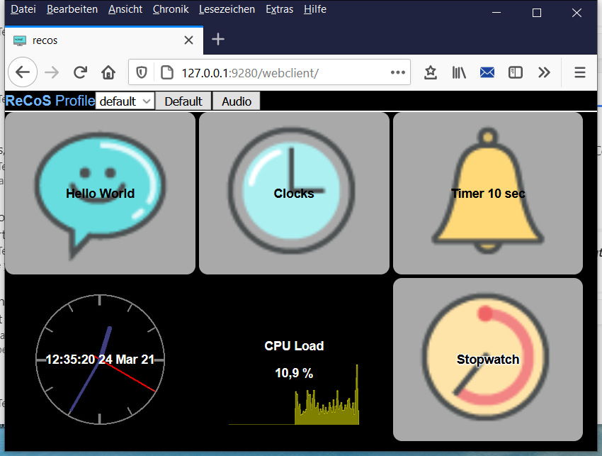

The client has a small toolbar and a big button area, presenting the different actions. But let us start at the very beginning. First, everything is organized in a **profile**. You can have different profiles for different clients, or different scenarios. One client can only present one profile at a time, but you can have different profiles in different browser open. As an example, you can have a special profile for your Phone and another for the Pad and a really big one for the PC. And all can be active at the same time. But to emphasize again, you can of course also operate the same profile on 2 different devices at the same time. When starting the client, the first profile is selected. You can select profiles using the Profile Combobox.

Each profile has different **pages** for further structuring. When the client starts, the first page is automatically selected. A page then consists of rows and columns. You can set the size in the Admin Client. The more rows and columns you have, the smaller the individual actions become. The page adapts its actions to the possible space. Pages can be changed directly via the toolbar (shown as buttons) or via special actions. Whether a page appears at the top of the bar can be set in the page configuration. If the page has no icon, only the name is displayed.

In the client area you will see 2 types of buttons and maybe some empty space. First, all buttons with the gray background are buttons that you can press. (**Single** Action)This is the default behavior. On Press the underlying commands will be executed on the computer where the service is running.

The buttons with the black background are for display purposes only. (**Display** Action) System states or other parameters are displayed there.

The empty fields are waiting for you so that you can store something there.

If you see a field with the red warning Action not defined, there is a misconfiguration. You may have deleted an action, but not removed it from the button.

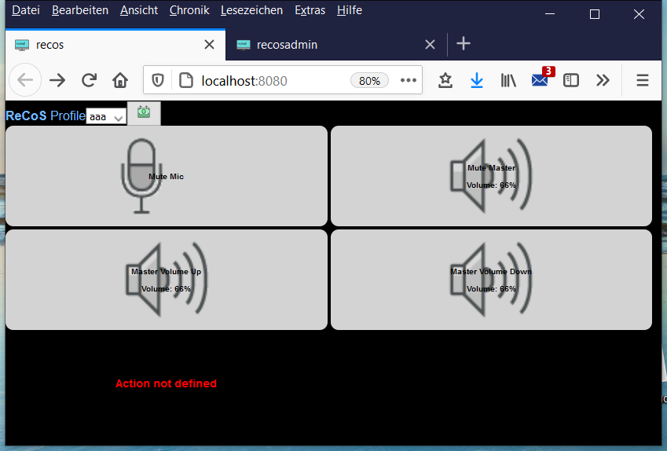

Buttons or actions can have several statuses. Depending on the situation, different icons are then displayed there. When a command is running, the hourglass is usually displayed. The turning position of the hourglass shows how many commands are currently being carried out. (Yes, actions can contain a command list)
In the case of so-called **multi**-actions, this action runs through a list of actions. The 1st action is carried out with the 1st press, the 2nd with the 2nd press and so on. The respective status is represented by the icon of the corresponding action.

As already mentioned, an action can contain several commands. (The "Hello World" action contains e.g. 3 commands: start notepad, wait a few seconds, write "Hello ReCoS"

# ReCoS Admin - Web Admin Interface

Writing to the service will be protected with a password. You can set this password in the service configuration. The default password is `recosadmin`. The username is `admin`. (But will not need this, until you try to access the Service interfaces directly)

To deactivate password check simply add an empty password to the configuration.

## Action Wizard

With the Action Wizard you can quickly and easily create new commands. You start the Action Wizard with this button.

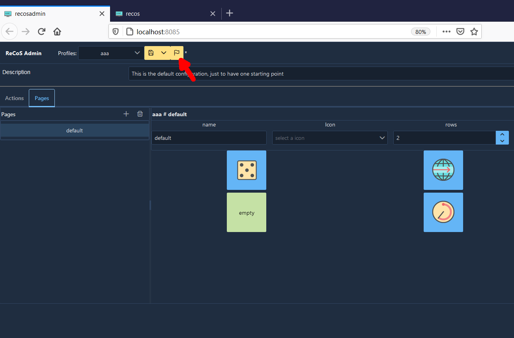

Or on the button assignments dialog:

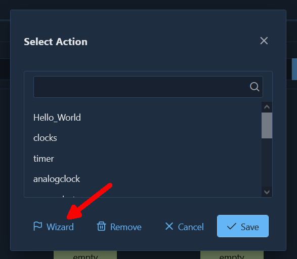

First you will see this preface page:


On the next page you can choose the command that should be generated. You can use the search field to search through the list of commands.

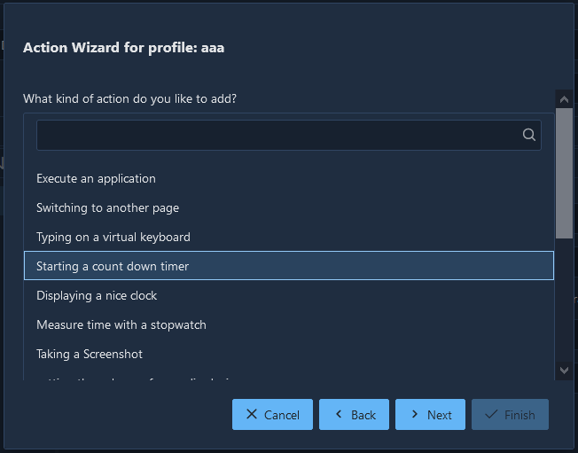

Go on with Next. 
In the next dialog you can provide some information about the command. You can assign a title for the button, assign an icon (a default is given directly by the command), and you can make various other settings depending on the command. Continue here with Next.

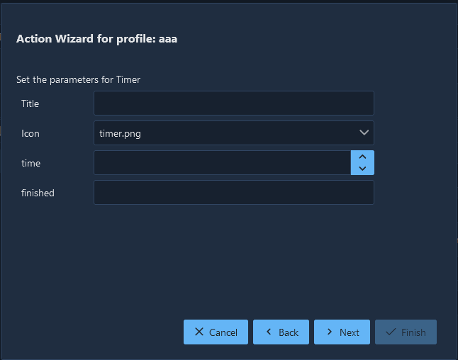

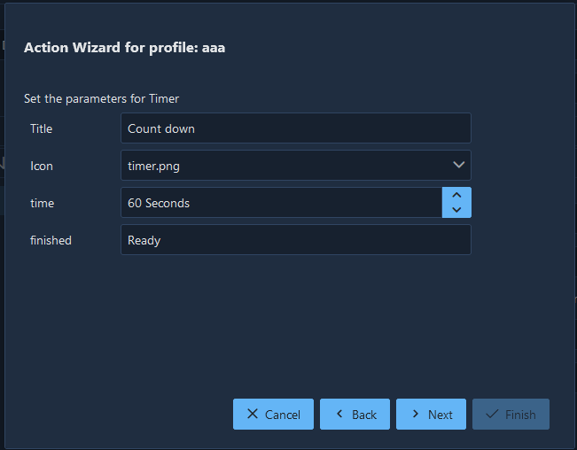

On this last page you can determine where the action should be displayed. You can select different pages here, or create a new page. Simply click on a free button where the action should be stored. To save the action and the profile, please select Finish.


In the Admin Client you can then see what the wizard has generated for you.

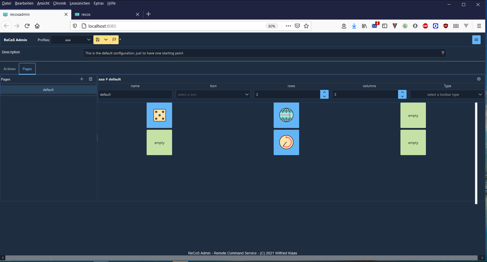

# ReCoS Service

The service is the main component of the ReCoS. This is the unit of work, doing all the nice things. But you will only see a little Icon in the taskbar. And there is a small context menu.


Here you can directly start the web interface or the admin client. And you can register the service to automatically start on windows start. Next option is to edit the service.yaml file, which contains all configuration for the service itself. Normally you don't need to do here anything, but just in case...
The last Menu entry is for shutting down the Service. 

## Profile configuration

Every profile has it's own configuration file. This file is written in yaml and has the following sections:

In the root you will find the following parameters

`name`: The name of the profile
`description`: a user readable description
`pages`: This are the different pages for showing up the actions
`actions`: a list of different actions. An action can appear on different pages. But as it's the same action, the status/result will be the same.

This is an example

```yaml
name: default
description: This is the default configuration, just to have one starting point
pages:
    - name: Default
      description: Some default command for every operating system
      columns: 3
      rows: 2
      toolbar: ""
      cells:
        - Hello_World
        - clocks
        - timer
        - analogclock
        - cpuload
        - stopwatch
    - name: clocks
      description: clocks only
      columns: 2
      rows: 2
      toolbar: hide
      cells:
        - Back
        - none
        - clock
        - analogclock
actions:
    - type: SINGLE
      name: Hello_World
      title: Hello World
      icon: chat.png
      description: Execute notepad and wirte Hello ReCoS to it.
      fontsize: 0
      fontcolor: ""
      outlined: false
      runone: true
      commands:
        - id: EXECUTE_0
          type: EXECUTE
          name: execute
          description: ""
          icon: ""
          title: ""
          parameters:
            args: []
            command: notepad.exe
            waitOnClose: false
        - id: DELAY_1
          type: DELAY
          name: delay
          description: ""
          icon: ""
          title: delay
          parameters:
            time: 3
        - id: KEYS_2
          type: KEYS
          name: typeit
          description: ""
          icon: ""
          title: typeit
          parameters:
            keys: Hello ReCoS
            layout: de
      actions: []
    - type: SINGLE
      name: clocks
      title: Clocks
      icon: clock.png
      description: Goto clocks page
      fontsize: 0
      fontcolor: ""
      outlined: false
      runone: true
      commands:
        - id: PAGE_3
          type: PAGE
          name: page
          description: ""
          icon: ""
          title: ""
          parameters:
            page: clocks
      actions: []
    - type: SINGLE
      name: timer
      title: Timer 10 sec
      icon: alarm_bell.png
      description: timer counting down 10 sec
      fontsize: 0
      fontcolor: ""
      outlined: false
      runone: true
      commands:
        - id: TIMER_4
          type: TIMER
          name: timer
          description: ""
          icon: ""
          title: ""
          parameters:
            finished: Fertig
            format: noch %ds
            time: 10
      actions: []
    - type: DISPLAY
      name: analogclock
      title: Analogclock
      icon: ""
      description: ""
      fontsize: 0
      fontcolor: white
      outlined: false
      runone: true
      commands:
        - id: CLOCK_5
          type: CLOCK
          name: clock
          description: ""
          icon: ""
          title: ""
          parameters:
            analog: true
            format: "15:04:05\r\n02 Jan 06"
      actions: []
    - type: SINGLE
      name: screenshot
      title: Screenshot
      icon: monitor.png
      description: doing a screenshot
      fontsize: 0
      fontcolor: ""
      outlined: false
      runone: true
      commands:
        - id: SCREENSHOT_6
          type: SCREENSHOT
          name: screenshot
          description: ""
          icon: ""
          title: ""
          parameters:
            display: 1
            saveto: e:/temp/screenshot
      actions: []
    - type: DISPLAY
      name: cpuload
      title: CPU Load
      icon: company.png
      description: cpu usage
      fontsize: 0
      fontcolor: white
      outlined: false
      runone: true
      commands:
        - id: HARDWAREMONITOR_7
          type: HARDWAREMONITOR
          name: cpu
          description: ""
          icon: ""
          title: ""
          parameters:
            color: '#ffff00'
            display: both
            format: '%0.1f %'
            sensor: CPU/Intel Core i7-6820HQ/Load/CPU Total
      actions: []
    - type: SINGLE
      name: stopwatch
      title: Stopwatch
      icon: timer.png
      description: simple stop watch
      fontsize: 0
      fontcolor: black
      outlined: true
      runone: true
      commands:
        - id: STOPWATCH_8
          type: STOPWATCH
          name: stp1
          description: ""
          icon: ""
          title: ""
          parameters:
            format: 'Mom: %0m:%0s'
      actions: []
    - type: SINGLE
      name: clock
      title: text clock
      icon: clock.png
      description: ""
      fontsize: 0
      fontcolor: ""
      outlined: false
      runone: false
      commands:
        - id: CLOCK_9
          type: CLOCK
          name: clock
          description: ""
          icon: ""
          title: clock
          parameters: {}
      actions: []
    - type: SINGLE
      name: Back
      title: ""
      icon: ""
      description: ""
      fontsize: 0
      fontcolor: ""
      outlined: false
      runone: false
      commands:
        - id: PAGE_10
          type: PAGE
          name: Back
          description: ""
          icon: ""
          title: Back
          parameters:
            page: Default
      actions: []

```


### Page

A page is a view component mainly showing with rows and columns. Each of this cells will than visualize an action. The cells list will link to an action by name in the action list. The index of an action of a cell is calculated as 

`index = (cell.row * page.rows) + cell.column`

parameters:

`name`: The name of the page
`description`: a user readable description
`icon`: the icon of this page
`columns`: Number of columns on the page
`rows`: Number of rows on the page
`toolbar`: `show`, this page will appear in the toolbar to directly switch to, `hide`, if this page should appear in the toolbar. With the page command you can switch to this page.
`cells`: List of names of the action per cell

Example:

```yaml
name: page1
icon: clock.png
columns: 5
rows: 5
cells:
  - action1
  - action2
  - action3
```


### Action

An action is the part which defines, what to do if a cell is triggered. 

The following parameters are used:

`type`: **`SINGLE`** is a single shot action. The action is always starting the command list. 
**`DISPLAY`** is a display only cell. It will only show Text, Icons, or images, but you can't interact with it.
**`MULTI`** is the third option. Here you can define 3 or more stages, and you every stage you can define the status and a command list, which is fired on activating this stage. As you can see, a simple on/off switch is a Multi with 2 Stages.
`name`: s the name of the action
title: the title of the action used by the UI
`description`: user defined description of this action
`runone`: is true or false. On true, if the action is fired twice, all commands of the first execution must be finished before the second execution will take place. On false, the execution will start directly without checking the action execution state.
`icon`: the icon which will be displayed on the cell
`fontsize`: the size of the title and the text, defaults to 14
`fontcolor`: the color of the title and the text, defaults to black
`outlined`: true or false, sometime reading a black text on a black ground is a little bit difficult. lining out can help.
`commands`: list of commands for execution of this action
`actions`: only apply in a MULTI action. For every stage there should be the name of the action which will be called, when the stage is executed. If a stage is executed, the icon of the last executed action (stage) will be displayed as the icon of the multi action and the title will be displayed on the text line. Example for a multi action:

```yaml
type: MULTI
name: action2
title: Multi Action
description: description for action
icon: hand_share.png
actions:
 - action2_1
 - action2_2
 - action2_3
```

Example for a single action:

```yaml
type: SINGLE
name: action1
title: Action Title Sync
description: description for action
fontsize: 10
fontcolor: "#FF0000"
outlined: true
runone: true
icon: trash_can.png
commands:
  - type: DELAY
    name: delay
    parameters:
      time: 2
  - type: EXECUTE
    name: execute
    parameters:
      command: echo.bat 
      args:
        - "Hello world"
  - type: DELAY
    name: delay
    parameters:
      time: 1
```


#### Command

This is the unit of work, which should be executed

`type`: the type of the command
`name`: names the command
`description`: a user readable description
`icon`: should be the icon that should be displayed when running this command
`title`: should be the text that should be displayed when running this command
`parameters`: parameters defers from command to command

##### No Operation

Do nothing.

`Type`: `NOOP`

`Parameter`:  none

Example

```yaml
type: DELAY
name: delay
icon: accesibility.png 
title: Do Nothing
```

##### Audiocontrol

taking control over your audio devices.

With this command, you can take control different audio devices for setting volume and mute. 

`type`: `AUDIOVOLUME`

Parameter:
`device`: the device that you would like to control. There are different devices in your system. Which one you can select, can be seen in the admin interface or on startup in the console. There are 2 defaults: `master` for the master output. This is on widows the one that you can control directly with the taskbar icon. And `mic` which is for the default input device. 
`command`: this is the command you want to fire. `mute`, which toggles the mute state. `volume up` for increase and `volume down` for decreasing the volume of that device.

```yaml
type: AUDIOVOLUME
name: audiovolume_3
description: new AUDIOVOLUME command created by ActionWizard
icon: ""
title: ""
parameters:
  command: volume up
  device: master
```

##### Clock


Just a clock in different designs.

`type`: `CLOCK`

`Parameter`: 

`format`: the format of the time in Golang format syntax, defaults: 15:04:05
`dateformat`: the format of the date in Golang format syntax, used by different designs, defaults: 02.01
`analog`: true or false, shows an analog clock
`timezone`: string with the name of the timezone of the IANA Timezone database (https://en.wikipedia.org/wiki/List_of_tz_database_time_zones)
`design`: the design of the clock. `analog` is for a analog clock, `digital` showing a nice digital clock, `berlin` is showing the berlin clock (https://en.wikipedia.org/wiki/Mengenlehreuhr).
There is another Berlin clock, called `berlin2`, which is created in svg format. It's usually better for smaller resolutions. 

`showseconds`: showing the seconds in the design. 
`showdate`: showing the date in the design formatted with dateformat. 
`color`: the color of the segments of the digital clock

Example 1: simple textual clock

```yaml
type: CLOCK
name: clock
parameters:
  format: "15:04:05 02 Jan 06"
```

Example 2: showing a nice digital clock with red 7-segment digits 

```yaml
type: CLOCK
name: clock_1
description: new CLOCK command created by ActionWizard
parameters:
  format: "02-01"
  analog: true
  design: digital
  showseconds: true
  color: "#ff0000"
```


##### Counter

just a simple counter.

A simple counter, with persisting value.

`type`: `COUNTER`

`Parameter`: 
`persist`: true or false, if true, the counter will persist between service restarts
`oldschool`: rendering an old school counter with 7-segment digits
`color`: the color of the segments

Example

```yaml
type: COUNTER
name: counter_0
description: count the clicks
parameters:
  persist: true 
```

##### Days remain

show the days remains to a end date.

This will show the days remain until a end date.

`Type`: DAYSREMAIN

`Parameter`: 

`date`: end date in format "yyyy-mm-dd"
`formatTitle`: the title message for the response, defaults %d
`formatText`: the text message for the response, defaults %d
`finished`: the message at the end of the days remain, defaults: finished

Example

```yaml
type: DAYSREMAIN
name: daysremain_0
description: new Days remain command created by ActionWizard
parameters:
  date: "2021-11-26"
  formattitle: "%d"
  formattext: "bis 53"
  finnished: "53"
```


##### Delay

`type`: `DELAY`

`Parameter`: 

`time`: time to delay in Seconds

Example

```yaml
type: DELAY
name: delay
parameters:
  time: 2
```

##### Dice

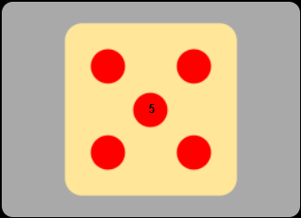

rolling the dice
A simple dice implementation with nice ui and different values.

`type`: `DICE`

`Parameter`: 
`sides`: the number of sides of the dice. For sides <= 9a nice UI is implemented.

Example

```yaml
type: DICE
name: dice_0
parameters:
  sides: 6 
```

##### Execute

`type`: `EXECUTE`

Parameter:

`command`: the executable or shell script to execute, with or without path
`args`: list of string arguments to this executable
`waitOnClose`: waits until the executable is closed or script is finnished.

Example

```yaml
type: EXECUTE
name: execute
parameters:
  command: go.exe 
  args:
    - "version"
  waitOnClose: true
```

##### Hardware monitor

This command connects to the openhardwaremonitor application on windows. With this you can get different sensors of your computer. For using the webserver of the openhardwaremonitor app, you have to add another external configuration into the main service configuration. The url is the url to the app webserver added with data.json. the `updateperiod` is the update time in seconds. 

```yaml
extconfig:
  openhardwaremonitor:
	url: http://127.0.0.1:12999/data.json
	updateperiod: 5
```

If you have configured this, the service will evaluate on startup the connection and all possible sensor names. This list of names you will see in the log and in the configuration there is a file sensorlist.txt with all sensors names. The sensor name starts with the category, like CPU, GPU or Memory, followed by the hardware component. After that there is the sensor type like Clocks, Temperatures or Load, followed by the sensor name. To use a sensor name manually you have to copy the whole name: like `"CPU/Intel Core i7-6820HQ/Load/CPU Total"`

On the action side you have to configure this:

`type`: `HARDWAREMONITOR`

Parameter:
`sensor`: the sensor name like given above.
`format`: the format string for the textual representation
`display`: text, graph,  text shows only the textual representation, graph shows both
`ymin`: the value for the floor of the graph
`ymax`: the value for the bottom of the graph
`color`: color of the graph

```yaml
type: HARDWAREMONITOR
name: cpu
parameters:
  sensor: "CPU/Intel Core i7-6820HQ/Temperature/CPU Package"
  format: "%0.1f °C"
  display: text
  ymin: 30
  ymax: 80
  color: "#ff0000"
```

##### Homematic

For integrating a homematic system to the ReCoS there are 3 different commands.

First you have to configure your homematic in the service configuration. (See Installing Homematic)

After that you can use the 3 commands:

Starting a program is very simple: simply using the name as the name for the program.

```yaml
type: HMPROGRAMS
name: hmprograms_0
description: new HMPROGRAMS command created by ActionWizard
parameters:
  name: Gartenlicht ein
```

A Switch is for using the button as a switch. Simply on/off. For both states you can add a different icon. The text field of the button always shows the actual state. (Even if you switch the device via other software/hardware solutions) 

`name` is the name of the "device: channel".

```yaml
type: HMSWITCH
name: hmswitch_0
description: new HMSWITCH command created by ActionWizard
parameters:
  name: 'Gartenhütte: Licht'
  officon: ""
  onicon: light_bulb.png
```

For dimmer and shutter you can use the third command. 
`name` is the device/channel.
action: can have the different actions:
   `set value`: setting a value directly (in percent)
   `up`: incrementing the value in percent steps. The step size is configurable via `value` .
   `down`: decrementing the value in percent steps. The step size is configurable via `value` .
`value`: the value or the step size.

```yaml
type: HMDIMMER
name: hmdimmer_0
description: new HMDIMMER command created by ActionWizard
parameters:
  name: 'GästeRollade: GästeRollade'
  action: set value
  value: 30
```


For all commands it is necessary that the names of devices/channels are unique.

##### Keys

Sending keys to the active application. This command is emulating a keyboard input by sending key strokes of a keyboard to the active application. You can use different keyboard layouts and there are some macros defining special keys.

`type`: `KEYS`

`keylayout`: defining the layout of the keyboard used to send the data. en for English (us) "qwerty" and de for a German "qwertz" keyboard layout. Default is "de"

`keystrokes`: are the string with the keys used to send. For special keys there are defined special macros. Every macro starts with an "{" and ends than with "}". If you want to send the "{" as a character simply double this. ("{" -> "{{"). 

Another specialized character is the "~" char. It will lead into a 1 second delay between the typing. To get the "~" Character, simple double it.

The following macros are defined: 

| Macro               | Keyboard key          |
| ------------------- | --------------------- |
| backspace, bs, bksp | backspace             |
| break               | break                 |
| capslock            | caps lock             |
| del, delete         | delete                |
| down                | arrow down            |
| end                 | end                   |
| enter               | enter                 |
| esc                 | esc                   |
| help                | help                  |
| home                | home                  |
| ins, insert         | insert                |
| left                | arrow left            |
| num                 | num lock              |
| pgdn                | page down             |
| pgup                | page up               |
| prtsc               | print screen          |
| right               | arrow right           |
| scrolllock          | scroll lock           |
| tab                 | tab                   |
| up                  | arrow up              |
| f1 .. f12           | function key 1 ... 12 |


```yaml
type: KEYS
name: sendkeys
parameters:
  keylayout: de
  keystrokes: "akteon00{enter}"
```

##### Mediacontrol

taking control over your media player.

With this command, you can take simple control of your media player. The commands are Start, Stop, Next and Previous. 

`type`: `MEDIAPLAY`

Parameter:
`command`: this is the command you want to fire. `start`, which starts the mediaplayer or pause it, if it's already started. `stop` for stopping the player and `next` and  `previous` for going to the next/previous part.

```yaml
type: MEDIAPLAY
name: mediastart_0
description: new MEDIAPLAY command created by ActionWizard
parameters:
  command: start
```

##### OBS - Open Broadcaster Software

This is a set of commands to control your obs installation.

###### OBS Start/Stop

Start/Stop recording or streaming

`type`: `OBSSTARTSTOP`

Parameter:
`mode`: the mode to start/stop, recording or streaming

```yaml
type: OBSSTARTSTOP
name: OBSStartStop
parameters:
  mode: recording
```

###### OBS Profile

switching the profile of obs

`type`: `OBSPROFILE`

Parameter:
`profile`: the name of the profile to switch to

```yaml
type: OBSPROFILE
name: OBSProfile
parameters:
  profile: GTA
```

###### OBS Scene Collection

switching the scene collection of obs

`type`: `OBSSCENECOLLECTION`

Parameter:
`scenecollection`: the name of the scene collection to switch to

```yaml
type: OBSSCENECOLLECTION
name: OBSSceneCollection
parameters:
  scenecollection: CrewVideo
```

###### OBS Scene 

switching the scene of obs with different commands.

`type`: `OBSSCENE`

Parameter:
`scenecommand`: the command to execute, possible commands are:

- `next`: switching to the next scene in the scene list, at the end it will roll over to the first scene
- `previous`: switching to the previous scene in the scene list, at the end it will roll over to the last scene
- `first, last`: switching to the first/last scene in the scene list
- `switch`: switching to a named scene in the scene list

```yaml
type: OBSSCENE
name: OBSScene
parameters:
  scenecommand: switch
  scenename: blurredVideo
```

##### Page

Switch to another page.

`type`: `PAGE`

Parameter:
`page`: the name of the page to switch to

```yaml
type: PAGE
name: page
parameters:
  page: page2
```

##### Philips Hue Lights and Scenes

2 Commandos for controlling Philips hue lights and groups.

`type`: `PHUELIGHTS` 

Parameter:
`name`: the name of the hue light, group, room or zone.  If a light is accessed the keyword "Light:" will be in front of the parameter, otherwise the keyword "Group:"
`brightness`: the brightness of the light  (1..254, 0 for unused)
`saturation`: the saturation of the light (1..254, 0 for unused)
`hue`: the hue of the light, this is a color value ranging from 1..65535, 0 for unused
`colortemp`: the color temperature of the light, this is a value ranging from 2000..6500, 0 for unused
`color`: the color of the light

`type`: `PHUESCENES`

Parameter:
`name`: the name of the hue group, room or zone.  
`scene`: the scene to apply to
`brightness`: the brightness of the group  (1..254, 0 for unused)

```yaml
type: PHUELIGHTS
name: hue_0
description: new PHUELIGHTS command created by ActionWizard
parameters:
  name: "Light: Hue color lamp 1"
  brightness: 0
  color: ff0000

type: PHUESCENES
name: hue_0
description: new PHUESCENES command created by ActionWizard
parameters:
  name: "office"
  scene: "winterday"
  brightness: 0
  color: ff0000

```

ATTENTION: As names of the lights, groups, scenes ... are used here to identify the object, please be sure that in the definition of those the names are unique. Otherwise ReCoS maybe control the only one of those.

##### Play audio

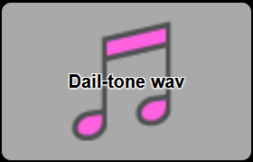

Playing an audio file. Available formats are: wav, mp3, ogg and flac.

`type`: `PLAYAUDIO`

Parameter:
`file`: the name and path to the audio file, which should be played. 

```yaml
type: PLAYAUDIO
name: playaudio_0
description: new PLAYAUDIO command created by ActionWizard
parameters:
  file: "../general/dial-tone.mp3"

```

##### Ping

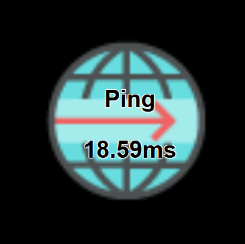

Shows ping times to a server.
Here you can test your connection to a server. Ping will test the connection to a server, You can use an IP Address or a server name (without any http...) If you put this command to an display action you can set a period so that the command will automatically start every #period seconds a test.  The result is the actual ping time in ms.

`type`: `PING`

Parameter:

`name`: the URL to ping to. You can use the Internet address name (without the protocol) or a simple IP address
`period`: the period in seconds when the command should automatically be executed. 

Example 1

```yaml
type: PING
name: ping_0
description: check ping with a url
parameters:
  name: www.wk-music.de
  period: 10
```

##### Random words

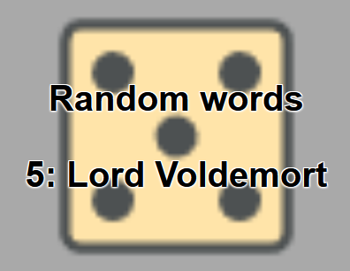

Choose a random word/phrase out of a list

`type`: `RNDWORDS`

`Parameter`: 
`words`: The list of words/phrases to choose one randomly from

Example

```yaml
type: RNDWORDS
name: words_0
description: new RNDWORDS command created by ActionWizard
parameters:
  words: 
    - "Harry Belafonte"
    - "Willie Klaas"
    - "Lukas Lars"
    - "Luke Skywalker"
    - "Lord Voldemort"
    - "Harry Potter"
```


##### Screen shot

making a screen shot.

With this command, you can take a screen shot. 

`type`: `SCREENSHOT`

Parameter:
`saveto`: the folder, where the screen shot will be saved. Format is `screen_<#number>_<display>.png`
`display`: optional, the number of the display, if you want to store screen shot of every display please use -1. Getting the right display, simply do a screen shot with display = -1. Than look at the screen shots and look in the name at the last number of the right image. That is your display.

```yaml
type: SCREENSHOT
name: screenshot
parameters:
  saveto: e:/temp/screenshot
  display: 1
```

##### Send message

`type`: `SENDMESSAGE`

Parameter:

`receiver`: the receiver of this message. `client` is for all clients having this particular action active, `service` is for the service itself. (Or more the user sitting on the service related desktop)
`message`: the message to send

Example 1

```yaml
type: SENDMESSAGE
name: sendmsg_0
description: new SENDMESSAGE command created by ActionWizard
parameters:
  message: "Hello World"
  receiver: client
```

##### Show text

Showtext will show a text on the button, and the icon of this command, if set, will be displayed as the title, too. 

`type`: SHOWTEXT

Parameter:
`text`: the text to show in the text field of the button. 

Example 1

```yaml
type: SHOWTEXT
name: showtext
title: showtext
parameters:
  text: Test
```


##### Start Browser

`type`: `BROWSE`

Parameter:

`url`: the URL to show in the system browser. On Windows if you choose a normal file system folder, it will automatically start the explorer on this path.

Example 1

```yaml
type: BROWSE
name: browse
description: start a new browser windows with a url
parameters:
  url: https://www.wk-music.de
```

Example 2

```yaml
type: BROWSE
name: browse
description: start a new explorer windows with a filepath
parameters:
  url: c:\windows
```


##### Stopwatch

A simple textual stopwatch.

`type`: `STOPWATCH`

`Parameter`: 

`format`: the format of the time. The `%` character signifies that the next character is a  modifier that specifies a particular duration unit. The following is the full list of modifiers supported by go-durationfmt:

- `%y` - # of years
- `%w` - # of weeks
- `%d` - # of days
- `%h` - # of hours
- `%m` - # of minutes
- `%s` - # of seconds
- `%%` - print a percent sign

You can place a `0` before the `h`, `m`, and `s` modifiers to zeropad those values to two digits. Zeropadding is undefined for the other modifiers.

Example

```yaml
type: STOPWATCH
name: stp1
parameters:
  format: "Mom: %0m:%0s "
```


##### Timer

Starting a timer with a response every second. You can define the format of the timer message and the message on finish.

`type`: TIMER

`Parameter`: 

`time`: time to delay in Seconds
`format`: the message for the response, defaults %d seconds
`finished`: the message at the end of the timer, defaults: finished

Example

```yaml
type: TIMER
name: timer
parameters:
  time: 10
  format: noch %ds
  finished: Fertig
```

##### WindowCtrl

Controlling Application Main Window.

With this command, you can control the main window of an application.

`type`: `WINDOWCTRL`

Parameter:
`caption`: the caption of the application window
`command`: the command to execute on this window. Possible values are:
`minimize`: for minimizing the application window
`activate`: for activating the application window again. (restore it if minimized and active/bring it to front) 
`move  x y`: moving the window to the new position x,y

```yaml
# activate the german calculator program
- type: WINDOWCTRL
  name: control window
  parameters:
    caption: Rechner 
    command: activate
# move it to it's new location
- type: WINDOWCTRL
  name: control window
  parameters:
    caption: Rechner 
    command: move 700 300 
# minimize it
- type: WINDOWCTRL
  name: control window
  parameters:
    caption: Rechner 
    command: minimize 
```

# Installing 3'rd Party products

For other 3'rd party products there is an so called integration for accessing the different parts. Here you can find some remarks on these integration.  

## Elagto Stream Deck (c)

The stream deck integration instrumented an Elgato stream deck for the ReCoS system. Since only one application can access the hardware, it is necessary that you deactivate and close the original stream deck application. You can then simply activate the stream deck integration in the section settings in the admin client.

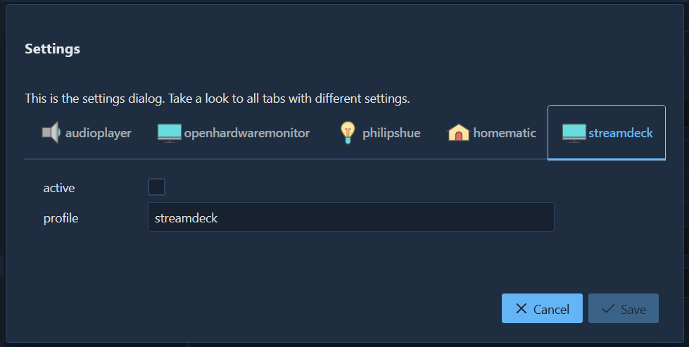 

The second parameter is optional. You can add here the profile, the stream deck will present. But there are defaults for it. For a normal stream deck (15 Button version, no matter whether revision 1 or 2) the default profile is called `streamdeck`. A profile with the name `streamdeck_mini` is expected for the Stream deck mini. The `streamdeck_xl` profile is expected for the XL. The following applies to all three, if the profile is not found and no profile is specified, the `default` profile is used. So that the profiles in the surface correspond to the display in the stream deck, you should create the rows and columns accordingly. For the normal stream deck the configuration is 3x5 (rows / cols) for the Mini 2x3 and for the XL 4x8. Other profile configurations also work, but it is possible that not all buttons are displayed on the stream deck or that they remain empty.

## Installation of OpenHardwareMonitor

For hardware sensor reading ReCoS uses the OpenHardwareMonitor Software. (https://openhardwaremonitor.org/) To use this, simply install the software. After installation, go to Option/Remote Web Server/Port. 

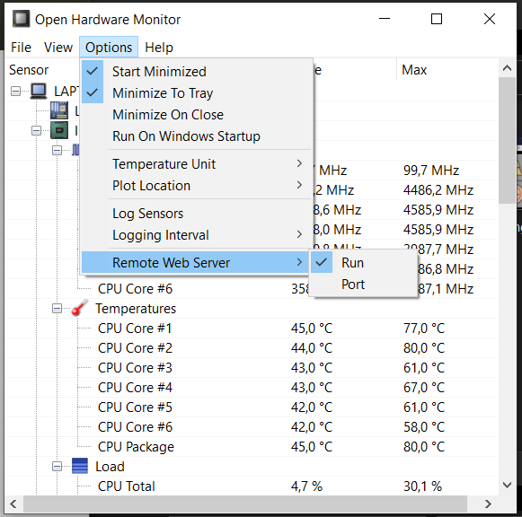

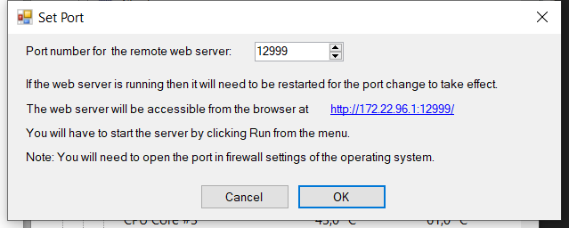

As Port number enter 12999 (which is the default for Combination of ReCoS and OHM)

After that simply activate the OHM Web server via Option/Remote Web Server/Run.
The OHM should be available after restart of windows, so please tick the following options on. Now everything of the OHM side is ready. The ReCoS service will now automatically connect to the OHM and get all Sensors. 

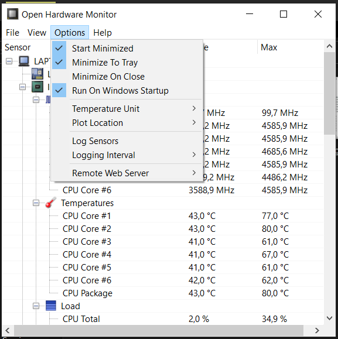

If you have already installed the OHM (maybe for another App) and you can't reconfigure the port option, you can simply change the port for ReCoS in the admin client. Same for the url, when you want to get sensors from another Computer.

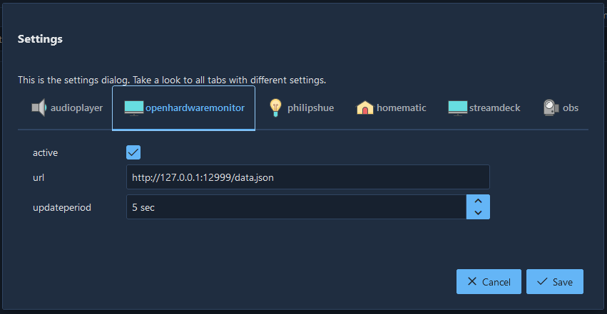

## Installation Philips Hue

First of all, a new user must be created for the ReCoS installation. To do this, please start your browser and go to the clip page of your Hue Bridge. 

http: // <IP address of the Hue Bridge> /debug/clip.html

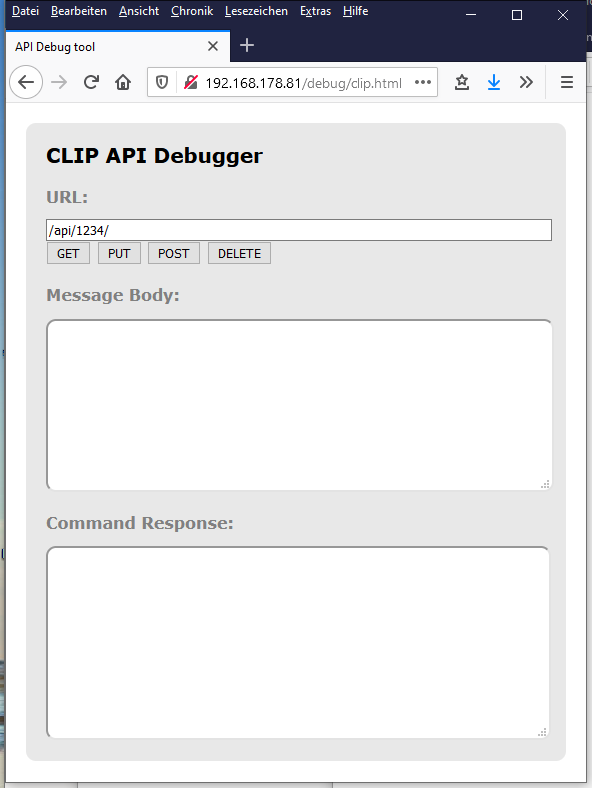

Now please post the following to the bridge.
URL: /api

Message Body: {"devicetype":"recos#hue_user"}

With the first attempt an error message appears.

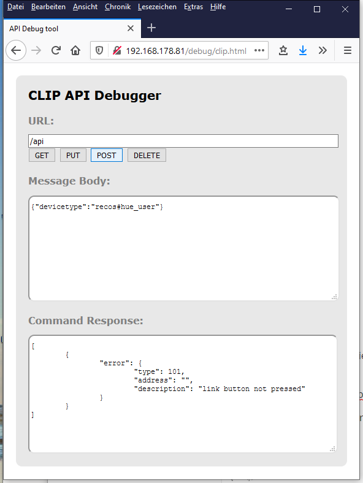

Please press the big button on the Philips Hue Bridge and post the same thing again.


Then copy the username from the answer:

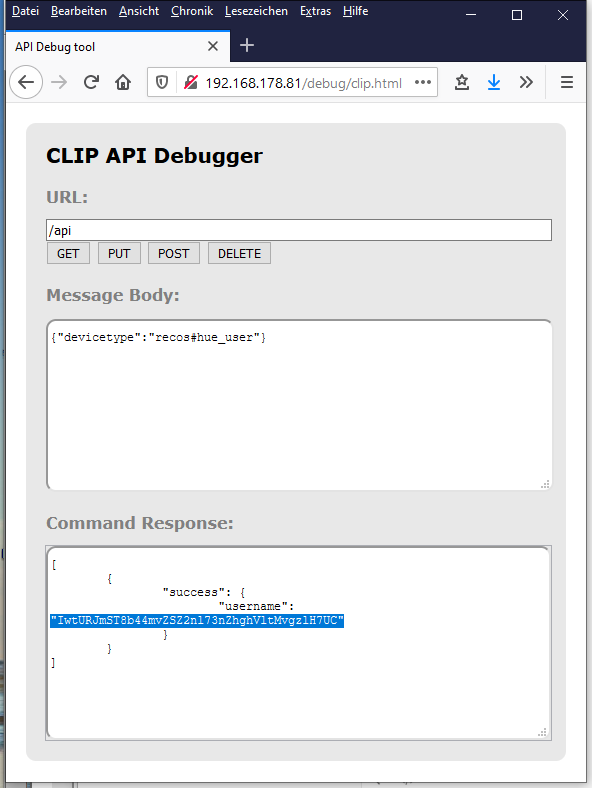

Now you have to change the ReCoS configuration. To do this, please start the admin client via the context menu.

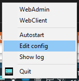

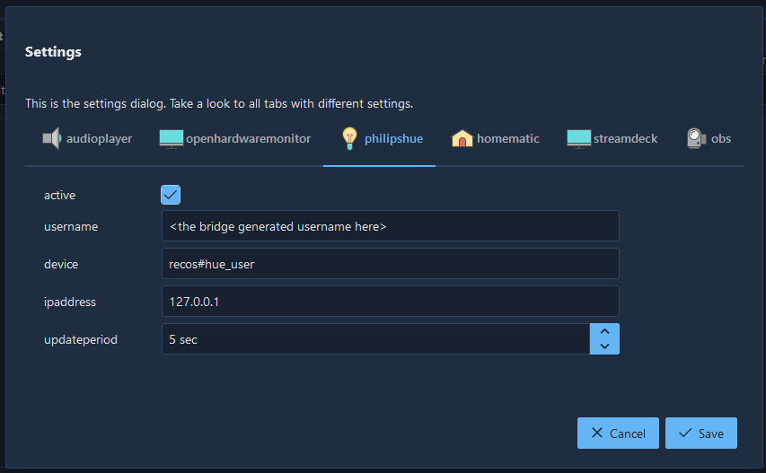Please enter the generated user name here as the `username` and change the `ipaddress` accordingly.
`updateperiod` is the time span in seconds in which ReCoS polls the bridge for changes.

## Homematic

For using the Hometmatic system for commands, you simply have to do 2 Things:
First you have to add the xmlapi addon to your homematic. 
https://github.com/homematic-community/XML-API

Second: add the url of your homematic system in the system config (via admin client/settings) and set the active state to true: 

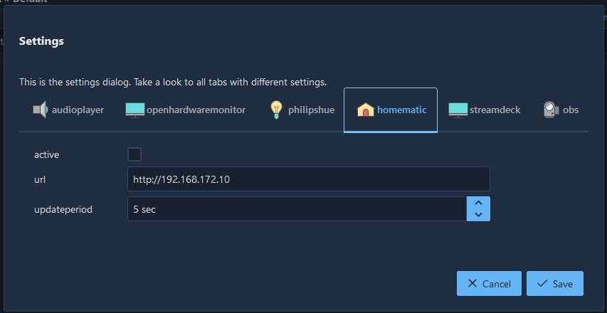

### OBS - Open Broadcaster Software

With ReCoS you can control some parts of your OBS Software.  This integration supports the OBS Studio. First you have to install the obs-websocket plugin.  At the moment only the version 4.9.0 is supported. (https://github.com/Palakis/obs-websocket/releases/tag/4.9.0) 

To activate the integration simply go to the settings page.

The host is the pc where the obs is installed. Normally this is the same pc, so 127.0.0.1 should work. The default port is 4444. (If you don't change it in the settings of the plugin) On the password field use the password you setup in the plugin settings (or leave it empty, if no password was been set.)

Thats all for setting up the integration.

# Thanks

Thanks goes to iconshock for the great icons set.
