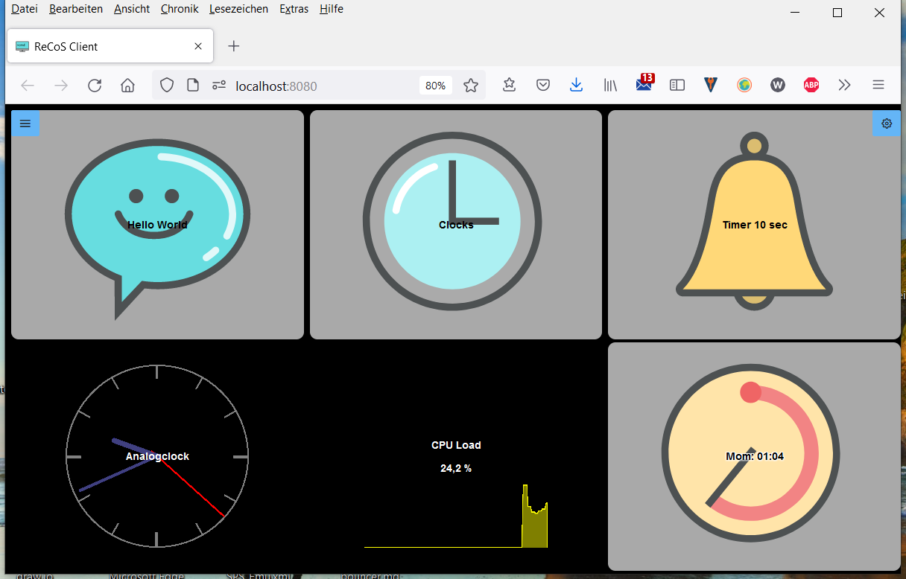

# Remote Command Service, ReCoS

Remote Command Service, for executing scripts remotely but secure. This project consists of different components. One is the service, a small golang based microservice, which delivers all the functionality behind the UI. This service is responsible for the execution of the different actions. 
On the other side there are two Web applications, build on top of VUE as the main UI Framework. One for the client controlling the actions, one for the administration. 

# Installation

Installation is simple. Execute the installer. After installation you have to start the service itself. It's called `recos-service.exe`. Nothing else to do here. After the sevice is up, simply go to the web page http://localhost:9280/webadmin for the admin client. 

For the normal execution client please use http://localhost:9280/webclient. On other machines simply change localhost to the ip of the computer where the service is running, like http://192.168.178.34/webclient

# ReCoS Client - Web Client Interface

This is the ReCoS web client. After successful installation you can access it with 
http://127.0.0.1:9280/webclient on the same computer.

# 


The client has a small toolbar and a big area, presenting the different actions. But let us start at the very beginning. First, everything is organized in a **profile**. You can have different profiles for different clients, or different scenarios. One client can only present one profile at a time, but you can have different profiles in different browser open. As an example, you can have a special profile for your Phone and another for the Pad and a really big one for the PC. And all can be active at the same time. But to emphasize again, you can of course also operate the same profile on 2 different devices at the same time. When starting the client, the first profile is selected. You can select profiles using the Profile Combobox.

Each profile has different **pages** for further structuring. When the client starts, the first page is automatically selected. A page then consists of rows and columns. You can set the size in the Admin Client. The more rows and columns you have, the smaller the individual actions become. The page adapts its actions to the possible space. Pages can be changed directly via the toolbar (shown as buttons) or via special actions. Whether a page appears at the top of the bar can be set in the page configuration. If the page has no icon, only the name is displayed.

In the client area you will see 2 types of buttons and maybe some empty space. First, all buttons with the gray background are buttons that you can press. (**Single** Action)This is the default behavior. On Press the underlying commands will be executed on the computer where the service is running.

The buttons with the black background are for display purposes only. (**Display** Action) System states or other parameters are displayed there.

The empty fields are waiting for you so that you can store something there.

If you see a field with the red warning Action not defined, there is a misconfiguration. You may have deleted an action, but not removed it from the button.


Buttons or actions can have several statuses. Depending on the situation, different icons are then displayed there. When a command is running, the hourglass is usually displayed. The turning position of the hourglass shows how many commands are currently being carried out. (Yes, actions can contain a command list)
In the case of so-called **multi**-actions, this action runs through a list of actions. The 1st action is carried out with the 1st press, the 2nd with the 2nd press and so on. The respective status is represented by the icon of the corresponding action.

As already mentioned, an action can contain several commands. (The "Hello World" action contains e.g. 3 commands: start notepad, wait a few seconds, write "Hello ReCoS"

# ReCoS Admin - Web Admin Interface

Writing to the service will be protected with a password. You can set this password in the service configuration. The default password is `recosadmin`. The username is `admin`. (But will not need this, until you try to access the Service interfaces directly)

To deactivate password check simply add an empty password to the configuration.

# Service

## Profileconfiguration

Every profile has it's own configuration file. This file is written in yaml and has the following sections:

In the root you will find the following parameters

`name`: The name of the profile
`description`: a user readable description
`pages`: This are the different pages for showing up the actions
`actions`: a list of different actions. An action can appear on different pages. But as it's the same action, the status/result will be the same.

This is an example

```yaml
name: default
description: This is the default configuration, just to have one starting point
pages:
    - name: Default
      description: Some default command for every operating system
      columns: 3
      rows: 2
      toolbar: ""
      cells:
        - Hello_World
        - clocks
        - timer
        - analogclock
        - cpuload
        - stopwatch
    - name: clocks
      description: clocks only
      columns: 2
      rows: 2
      toolbar: hide
      cells:
        - Back
        - none
        - clock
        - analogclock
actions:
    - type: SINGLE
      name: Hello_World
      title: Hello World
      icon: chat.png
      description: Execute notepad and wirte Hello ReCoS to it.
      fontsize: 0
      fontcolor: ""
      outlined: false
      runone: true
      commands:
        - id: EXECUTE_0
          type: EXECUTE
          name: execute
          description: ""
          icon: ""
          title: ""
          parameters:
            args: []
            command: notepad.exe
            waitOnClose: false
        - id: DELAY_1
          type: DELAY
          name: delay
          description: ""
          icon: ""
          title: delay
          parameters:
            time: 3
        - id: KEYS_2
          type: KEYS
          name: typeit
          description: ""
          icon: ""
          title: typeit
          parameters:
            keys: Hello ReCoS
            layout: de
      actions: []
    - type: SINGLE
      name: clocks
      title: Clocks
      icon: clock.png
      description: Goto clocks page
      fontsize: 0
      fontcolor: ""
      outlined: false
      runone: true
      commands:
        - id: PAGE_3
          type: PAGE
          name: page
          description: ""
          icon: ""
          title: ""
          parameters:
            page: clocks
      actions: []
    - type: SINGLE
      name: timer
      title: Timer 10 sec
      icon: alarm_bell.png
      description: timer counting down 10 sec
      fontsize: 0
      fontcolor: ""
      outlined: false
      runone: true
      commands:
        - id: TIMER_4
          type: TIMER
          name: timer
          description: ""
          icon: ""
          title: ""
          parameters:
            finished: Fertig
            format: noch %ds
            time: 10
      actions: []
    - type: DISPLAY
      name: analogclock
      title: Analogclock
      icon: ""
      description: ""
      fontsize: 0
      fontcolor: white
      outlined: false
      runone: true
      commands:
        - id: CLOCK_5
          type: CLOCK
          name: clock
          description: ""
          icon: ""
          title: ""
          parameters:
            analog: true
            format: "15:04:05\r\n02 Jan 06"
      actions: []
    - type: SINGLE
      name: screenshot
      title: Screenshot
      icon: monitor.png
      description: doing a screenshot
      fontsize: 0
      fontcolor: ""
      outlined: false
      runone: true
      commands:
        - id: SCREENSHOT_6
          type: SCREENSHOT
          name: screenshot
          description: ""
          icon: ""
          title: ""
          parameters:
            display: 1
            saveto: e:/temp/screenshot
      actions: []
    - type: DISPLAY
      name: cpuload
      title: CPU Load
      icon: company.png
      description: cpu usage
      fontsize: 0
      fontcolor: white
      outlined: false
      runone: true
      commands:
        - id: HARDWAREMONITOR_7
          type: HARDWAREMONITOR
          name: cpu
          description: ""
          icon: ""
          title: ""
          parameters:
            color: '#ffff00'
            display: both
            format: '%0.1f %'
            sensor: CPU/Intel Core i7-6820HQ/Load/CPU Total
      actions: []
    - type: SINGLE
      name: stopwatch
      title: Stopwatch
      icon: timer.png
      description: simple stop watch
      fontsize: 0
      fontcolor: black
      outlined: true
      runone: true
      commands:
        - id: STOPWATCH_8
          type: STOPWATCH
          name: stp1
          description: ""
          icon: ""
          title: ""
          parameters:
            format: 'Mom: %0m:%0s'
      actions: []
    - type: SINGLE
      name: clock
      title: text clock
      icon: clock.png
      description: ""
      fontsize: 0
      fontcolor: ""
      outlined: false
      runone: false
      commands:
        - id: CLOCK_9
          type: CLOCK
          name: clock
          description: ""
          icon: ""
          title: clock
          parameters: {}
      actions: []
    - type: SINGLE
      name: Back
      title: ""
      icon: ""
      description: ""
      fontsize: 0
      fontcolor: ""
      outlined: false
      runone: false
      commands:
        - id: PAGE_10
          type: PAGE
          name: Back
          description: ""
          icon: ""
          title: Back
          parameters:
            page: Default
      actions: []

```


### Page

A page is a view component mainly showing with rows and columns. Each of this cells will than visualize an action. The cells list will link to an action by name in the action list. The index of an action of a cell is calculated as 

`index = (cell.row * page.rows) + cell.column`

parameters:

`name`: The name of the page
`description`: a user readable description
`icon`: the icon of this page
`columns`: Number of columns on the page
`rows`: Number of rows on the page
`toolbar`: `show`, this page will appear in the toolbar to directly switch to, `hide`, if this page should appear in the toolbar. With the page command you can switch to this page.
`cells`: List of names of the action per cell

Example:

```yaml
name: page1
icon: clock.png
columns: 5
rows: 5
cells:
  - action1
  - action2
  - action3
```


### Action

An action is the part which defines, what to do if a cell is triggered. 

The following parameters are used:

`type`: **SINGLE** is a single shot action. The action is always starting the command list. 
**DISPLAY** is a display only cell. It will only show Text, Icons, or images, but you can't interact with it.
**MULTI** is the third option. Here you can define 3 or more stages, and you every stage you can define the status and a command list, which is fired on activating this stage. As you can see, a simple on/off switch is a Multi with 2 Stages.
`name`: s the name of the action
title: the title of the action used by the UI
`description`: user defined description of this action
`runone`: is true or false. On true, if the action is fired twice, all commands of the first execution must be finished before the second execution will take place. On false, the execution will start directly without checking the action execution state.
`icon`: the icon which will be displayed on the cell
`fontsize`: the size of the title and the text, defaults to 14
`fontcolor`: the color of the title and the text, defaults to black
`outlined`: true or false, sometime reading a black text on a black ground is a little bit difficult. lining out can help.
`commands`: list of commands for execution of this action
`actions`: only apply in a MULTI action. For every stage there should be the name of the action which will be called, when the stage is executed. If a stage is executed, the icon of the last executed action (stage) will be displayed as the icon of the multi action and the title will be displayed on the text line. Example for a multi action:

```yaml
type: MULTI
name: action2
title: Multi Action
description: description for action
icon: hand_share.png
actions:
 - action2_1
 - action2_2
 - action2_3
```

Example for a single action:

```yaml
type: SINGLE
name: action1
title: Action Title Sync
description: description for action
fontsize: 10
fontcolor: "#FF0000"
outlined: true
runone: true
icon: trash_can.png
commands:
  - type: DELAY
    name: delay
    parameters:
      time: 2
  - type: EXECUTE
    name: execute
    parameters:
      command: echo.bat 
      args:
        - "Hello world"
  - type: DELAY
    name: delay
    parameters:
      time: 1
```


#### Command

This is the command, which should be executed

`type`: the type of the command
`name`: names the command
`description`: a user readable description
`icon`: should be the icon that should be displayed when running this command
`title`: should be the text that should be displayed when running this command
`parameters`: parameters defers from command to command

##### No Operation

Do nothing.

`Type`: NOOP

`Parameter`:  none

Example

```yaml
type: DELAY
name: delay
icon: accesibility.png 
title: Do Nothing
```

##### Delay

`Type`: DELAY

`Parameter`: 

`time`: time to delay in Seconds

Example

```yaml
type: DELAY
name: delay
parameters:
  time: 2
```

##### Timer

Starting a timer with a response every second. You can define the format of the timer message and the message on finish.

`Type`: TIMER

`Parameter`: 

`time`: time to delay in Seconds
`format`: the message for the response, defaults %d seconds
`finished`: the message at the end of the timer, defaults: finished

Example

```yaml
type: TIMER
name: timer
parameters:
  time: 10
  format: noch %ds
  finished: Fertig
```

##### Days remain, show the days remains to a end date

This will show the days remain until a end date.

`Type`: DAYSREMAIN

`Parameter`: 

`date`: end date in format "yyyy-mm-dd"
`formatTitle`: the title message for the response, defaults %d
`formatText`: the text message for the response, defaults %d
`finished`: the message at the end of the days remain, defaults: finished

Example

```yaml
type: DAYSREMAIN
name: daysremain_0
description: new Days remain command created by ActionWizard
parameters:
  date: "2021-11-26"
  formattitle: "%d"
  formattext: "bis 53"
  finnished: "53"
```

##### Clock

Just a simple textual clock.

`Type`: CLOCK

`Parameter`: 

`format`: the format of the clock in Golang format syntax, defaults: 15:04:05
`analog`: true or false, shows an analog clock

Example

```yaml
type: CLOCK
name: clock
parameters:
  format: "15:04:05 02 Jan 06"
```

##### Stopwatch

A simple textual stopwatch.

`Type`: `STOPWATCH`

`Parameter`: 

`format`: the format of the time. The `%` character signifies that the next character is a  modifier that specifies a particular duration unit. The following is the full list of modifiers supported by go-durationfmt:

- `%y` - # of years
- `%w` - # of weeks
- `%d` - # of days
- `%h` - # of hours
- `%m` - # of minutes
- `%s` - # of seconds
- `%%` - print a percent sign

You can place a `0` before the `h`, `m`, and `s` modifiers to zeropad those values to two digits. Zeropadding is undefined for the other modifiers.

Example

```yaml
type: STOPWATCH
name: stp1
parameters:
  format: "Mom: %0m:%0s "
```


##### Execute

Type: `EXECUTE`

Parameter:

`command`: the executable or shell script to execute, with or without path
`args`: list of string arguments to this executable
`waitOnClose`: waits until the executable is closed or script is finnished.

Example

```yaml
type: EXECUTE
name: execute
parameters:
  command: go.exe 
  args:
    - "version"
  waitOnClose: true
```

##### Start Browser

`Type`: `BROWSERSTART`

Parameter:

`url`: the URL to show in the system browser

Example

```yaml
type: BROWSERSTART
name: browserstart
description: start a new browser windows with a url
parameters:
  url: https://www.wk-music.de
```

##### Page

Switch to another page.

type: `PAGE`

Parameter:
`page`: the name of the page to switch to

```yaml
type: PAGE
name: page
parameters:
  page: page2
```

##### Keys

Sending keys to the active application. This command is emulating a keyboard input by sending key strokes of a keyboard to the active application. You can use different keyboard layouts and there are some macros defining special keys.

type: `KEYS`

`keylayout`: defining the layout of the keyboard used to send the data. en for English (us) "qwerty" and de for a German "qwertz" keyboard layout. Default is "de"

`keystrokes`: are the string with the keys used to send. For special keys there are defined special macros. Every macro starts with an "{" and ends than with "}". If you want to send the "{" as a character simply double this. ("{" -> "{{"). 

Another specialized character is the "~" char. It will lead into a 1 second delay between the typing. To get the "~" Character, simple double it.

The following macros are defined: 

| Macro               | Keyboard key |
| ------------------- | ------------ |
| backspace, bs, bksp | backspace    |
| break               | break        |
| capslock            | caps lock    |
| del, delete         | delete       |
| down                | arrow down   |
| end                 | end          |
| enter               | enter        |
| esc                 | esc          |
| help                | help         |
| home                | home         |
| ins, insert         | insert       |
| left                | arrow left   |
| num                 | num lock     |
| pgdn                | page down    |
| pgup                | page up      |
| prtsc               | print screen |
| right               | arrow right  |
| scrolllock          | scroll lock  |
| tab                 | tab          |
| up                  | arrow up     |
| f1 .. f12           | function key 1 ... 12 |


```yaml
type: KEYS
name: sendkeys
parameters:
  keylayout: de
  keystrokes: "akteon00{enter}"
```

##### Controlling Application Main Window

With this command, you can control the main window of an application.

type: `WINDOWCTRL`

Parameter:
`caption`: the caption of the application window
`command`: the command to execute on this window. Possible values are:
`minimize`: for minimizing the application window
`activate`: for activating the application window again. (restore it if minimized and active/bring it to front) 
`move  x y`: moving the window to the new position x,y

```yaml
# activate the german calculator program
- type: WINDOWCTRL
  name: control window
  parameters:
    caption: Rechner 
    command: activate
# move it to it's new location
- type: WINDOWCTRL
  name: control window
  parameters:
    caption: Rechner 
    command: move 700 300 
# minimize it
- type: WINDOWCTRL
  name: control window
  parameters:
    caption: Rechner 
    command: minimize 
```

##### Screenshot, making a screenshot

With this command, you can take a screenshot. 

type: `SCREENSHOT`

Parameter:
`saveto`: the folder, where the screen shot will be saved. Format is `screen_<#number>_<display>.png`
`display`: optional, the number of the display, if you want to store screen shot of every display please use -1. Getting the right display, simply do a screen shot with display = -1. Than look at the screen shots and look in the name at the last number of the right image. That is your display.

```yaml
type: SCREENSHOT
name: screenshot
parameters:
  saveto: e:/temp/screenshot
  display: 1
```

##### Audiocontrol, taking control over your audio devices

With this command, you can take control different audio devices for setting volume and mute. 

type: `AUDIOVOLUME`

Parameter:
`device`: the device that you would like to control. There are different devices in your system. Which one you can select, can be seen in the admin interface or on startup in the console. There are 2 defaults: `master` for the master output. This is on widows the one that you can control directly with the taskbar icon. And `mic` which is for the default input device. 
`command`: this is the command you want to fire. `mute`, which toggles the mute state. `volume up` for increase and `volume down` for decreasing the volume of that device.

```yaml
type: AUDIOVOLUME
name: audiovolume_3
description: new AUDIOVOLUME command created by ActionWizard
icon: ""
title: ""
parameters:
  command: volume up
  device: master
```

##### Mediacontrol, taking control over your media player

With this command, you can take simple control of your media player. The commands are Start, Stop, Next and Provious. 

type: `MEDIAPLAY`

Parameter:
`command`: this is the command you want to fire. `start`, which starts the mediaplayer or pause it, if it's already started. `stop` for stopping the player and `next` and  `previous` for going to the next/previous part.

```yaml
type: MEDIAPLAY
name: mediastart_0
description: new MEDIAPLAY command created by ActionWizard
parameters:
  command: start
```

##### Hardware monitor

This command connects to the openhardwaremonitor application on windows. With this you can get different sensors of your computer. For using the webserver of the openhardwaremonitor app, you have to add another external configurationinto the main service configuration. The url is the url to the app webserver added with data.json. the `updateperiod` is the update time in seconds. 

```yaml
extconfig:
  openhardwaremonitor:
	url: http://127.0.0.1:12999/data.json
	updateperiod: 5
```

If you have configured this, the service will evaluate on startup the connection and all possible sensor names. This lsit of names you will see in the log. The sensor name starts with the category, like CPU, GPU or Memory, followed by the hardware component. After that there is the sensor type like Clocks, Temperatures or Load, followed by the sensor name. To use a sensor you have to copy the whole name: like `"CPU/Intel Core i7-6820HQ/Load/CPU Total"`

e.g.: 

```
2021/02/18 08:47:17 found sensor with name: CPU/Intel Core i7-6820HQ/Clocks/Bus Speed
2021/02/18 08:47:17 found sensor with name: CPU/Intel Core i7-6820HQ/Clocks/CPU Core #1
2021/02/18 08:47:17 found sensor with name: CPU/Intel Core i7-6820HQ/Clocks/CPU Core #2
2021/02/18 08:47:17 found sensor with name: CPU/Intel Core i7-6820HQ/Clocks/CPU Core #3
2021/02/18 08:47:17 found sensor with name: CPU/Intel Core i7-6820HQ/Clocks/CPU Core #4
2021/02/18 08:47:17 found sensor with name: CPU/Intel Core i7-6820HQ/Temperature/CPU Core #1
2021/02/18 08:47:17 found sensor with name: CPU/Intel Core i7-6820HQ/Temperature/CPU Core #2 
2021/02/18 08:47:17 found sensor with name: CPU/Intel Core i7-6820HQ/Temperature/CPU Core #3 
2021/02/18 08:47:17 found sensor with name: CPU/Intel Core i7-6820HQ/Temperature/CPU Core #4 
2021/02/18 08:47:17 found sensor with name: CPU/Intel Core i7-6820HQ/Temperature/CPU Package 
2021/02/18 08:47:17 found sensor with name: CPU/Intel Core i7-6820HQ/Load/CPU Total 
2021/02/18 08:47:17 found sensor with name: CPU/Intel Core i7-6820HQ/Load/CPU Core #1 
2021/02/18 08:47:17 found sensor with name: CPU/Intel Core i7-6820HQ/Load/CPU Core #2 
2021/02/18 08:47:17 found sensor with name: CPU/Intel Core i7-6820HQ/Load/CPU Core #3 
2021/02/18 08:47:17 found sensor with name: CPU/Intel Core i7-6820HQ/Load/CPU Core #4 
2021/02/18 08:47:17 found sensor with name: CPU/Intel Core i7-6820HQ/Powers/CPU Package 
2021/02/18 08:47:17 found sensor with name: CPU/Intel Core i7-6820HQ/Powers/CPU Cores 
2021/02/18 08:47:17 found sensor with name: CPU/Intel Core i7-6820HQ/Powers/CPU Graphics 
2021/02/18 08:47:17 found sensor with name: CPU/Intel Core i7-6820HQ/Powers/CPU DRAM 
2021/02/18 08:47:17 found sensor with name: Memory/Generic Memory/Load/Memory 
2021/02/18 08:47:17 found sensor with name: Memory/Generic Memory/Data/Used Memory 
2021/02/18 08:47:17 found sensor with name: Memory/Generic Memory/Data/Available Memory 
2021/02/18 08:47:17 found sensor with name: GPU/AMD FirePro W5170M/Voltages/GPU Core 
2021/02/18 08:47:17 found sensor with name: GPU/AMD FirePro W5170M/Clocks/GPU Core 
2021/02/18 08:47:17 found sensor with name: GPU/AMD FirePro W5170M/Clocks/GPU Memory 
2021/02/18 08:47:17 found sensor with name: GPU/AMD FirePro W5170M/Temperature/GPU Core 
2021/02/18 08:47:17 found sensor with name: GPU/AMD FirePro W5170M/Load/GPU Core 
2021/02/18 08:47:17 found sensor with name: GPU/AMD FirePro W5170M/Fans/GPU Fan 
2021/02/18 08:47:17 found sensor with name: GPU/AMD FirePro W5170M/Data/GPU Fan 
2021/02/18 08:47:17 found sensor with name: Storage/HGST HTS721010A9E630/Temperature/Temperature 
2021/02/18 08:47:17 found sensor with name: Storage/HGST HTS721010A9E630/Load/Used Space 
2021/02/18 08:47:17 found sensor with name: Storage/PC300 NVMe SK hynix 256GB/Temperature/Temperature 2021/02/18 08:47:17 found sensor with name: Storage/PC300 NVMe SK hynix 256GB/Load/Used Space 
2021/02/18 08:47:17 found sensor with name: Storage/Generic Hard Disk/Load/Used Space
```

On the action side you have to configure this:

type: `HARDWAREMONITOR`

Parameter:
`sensor`: the sensor name like given above.
`format`: the format string for the textual representation
`display`: text, graph,  text shows only the textual representation, graph shows both
`ymin`: the value for the floor of the graph
`ymax`: the value for the bottom of the graph
`color`: color of the graph

```yaml
type: HARDWAREMONITOR
name: cpu
parameters:
  sensor: "CPU/Intel Core i7-6820HQ/Temperature/CPU Package"
  format: "%0.1f °C"
  display: text
  ymin: 30
  ymax: 80
  color: "#ff0000"
```

# UI

As this project is in an early development stage, i have nothing to show here. But if you like, you can simply checkout the develop branch, starting 2 Instances of Visual Studio Code, one with the frontend, one with the service backend. Than start the backend server in VS, and same for the frontend (npm run serve). After some hacking with configuration you may be able to see something. :-) Good Luck to you.

# Thanks

Thanks goes to iconshock for the great icons set.