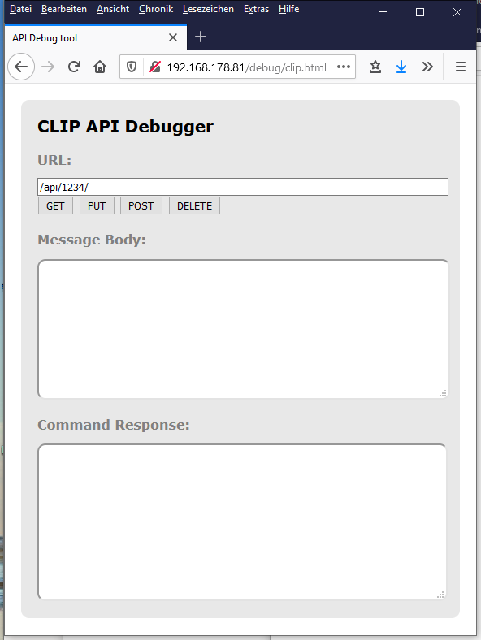
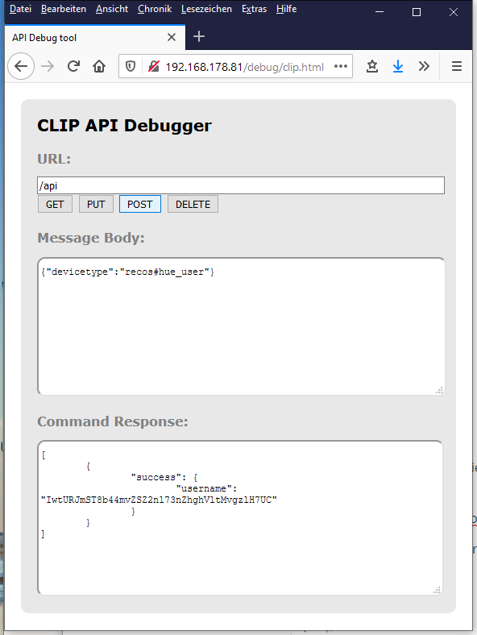

# Philips Hue

## Erstinstallation

Zunächst muss für die ReCoS Installation ein neuer User erstellt werden. Dazu starten Sie bitte ihren Browser und gehen auf die Clip Seite ihrer Hue Bridge.

http://<IP Adresse der Hue Bridge>/debug/clip.html

 Jetzt posten Sie bitte folgendes zur Bridge. 

{"devicetype":"recos#hue_user"}

Beim 1. versuch kommt zunächst eine Fehlermeldung. 

Drücken Sie bitte nun auf den großen Button auf der Philips Hue Bridge und posten Sie das gleiche noch einmal.

Danack kopieren Sie bitte aus der Antwort den Benutzernamen:

Diesen tragen Sie nun in der externalconfig im Bereich philips_hue diesen String als username ein.

Somit ist die Bridge jetzt für ReCoS eingerichtet. 

